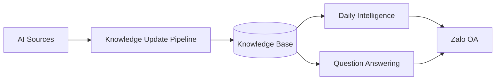

<div align="center">

# AI-Radar

### Knowledge Intelligence System for AI Research

Automatically collect, process, organize, and retrieve AI knowledge through Daily Intelligence and Semantic Question Answering.


</div>

---

# 🚀 Overview

AI-Radar is a **Knowledge Intelligence System** designed to address the growing challenge of information overload in the rapidly evolving AI ecosystem.

Instead of acting as a chatbot or a simple RSS aggregator, AI-Radar continuously transforms fragmented AI information into structured knowledge that can be consumed through:

- 📬 Daily AI Intelligence Digest
- 🔍 Semantic Question Answering (RAG)
- 📚 Long-term Knowledge Base

The project follows a **Documentation-First** approach, where every architectural and implementation decision is documented before development begins.

---

# ❓ Why AI-Radar?

Modern AI knowledge is scattered across:

- Research Papers
- GitHub Repositories
- Hugging Face
- Technical Blogs
- Newsletters
- Community Discussions

AI-Radar continuously collects, filters, processes and transforms those sources into a searchable knowledge base, allowing users to stay updated without manually following dozens of information channels.

---

# ✨ Key Features

- 🤖 Automated Knowledge Collection
- 🧠 Knowledge Processing & Normalization
- 📬 Daily AI Intelligence Digest
- 🔎 Semantic Question Answering (RAG)
- 💬 Zalo Official Account Integration
- 📦 Structured Knowledge Storage

---

# 📸 Project Preview

> 🚧 **Coming Soon**

Screenshots, demo GIFs and runtime demonstrations will be added as implementation progresses.

<!-- Future Assets -->

```text
assets/images/
├── dashboard.png
├── daily-digest.png
├── knowledge-update.png
└── qa-demo.gif
```

---

# 🏗 High-Level Workflow



For the complete architecture, please refer to the **Architecture Documentation**.

---

# 📚 Documentation

The project documentation is organized into dedicated document sets.

| Document | Description |
|-----------|-------------|
| 📘 **Software Design Document (SDD)** | Requirements, system design and data model |
| 🏛 **Architecture** | System organization, runtime and operations |
| 📝 **Decision Log** | Design rationale and architectural decisions |
| 🔌 **API Specification** | Internal APIs and Webhook reference |

> All detailed technical documentation is located in the **docs/** directory.

---

# 🛠 Tech Stack

| Category | Technology |
|-----------|------------|
| Language | Python 3.10+ |
| AI Framework | LangChain |
| LLM Provider | Groq API |
| Embedding | Cohere Embeddings |
| Vector Database | Qdrant |
| Scheduler | GitHub Actions |
| Notification | Zalo Official Account |
| Deployment | Docker & Docker Compose |

---

# 📈 Project Status

| Status | Progress |
|---------|----------|
| Documentation | ✅ Completed |
| Project Planning | 🟡 In Progress |
| Implementation | ⏳ Upcoming |
| Testing | ⏳ Planned |
| Deployment | ⏳ Planned |

**Current Phase**

> Documentation & Project Planning

**Next Milestone**

> Core Implementation

---

# 🗺 Roadmap

- ✅ Foundation & Design
- ✅ Architecture Documentation
- ✅ Decision Log
- ✅ API Specification
- 🔄 Project Planning
- ⏳ Core Implementation
- ⏳ Integration & Testing
- ⏳ Production Deployment

---

# ⚡ Getting Started

> 🚧 **Coming Soon**

The installation guide, Docker setup and local development workflow will be available after the implementation phase begins.

---

# 📄 License

This project is licensed under the **MIT License**.

See the `LICENSE` file for details.

---

<div align="center">

**AI-Radar**

*Turning scattered AI information into structured knowledge.*

</div>