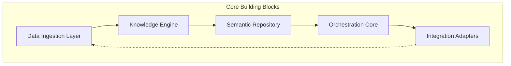

# Core Building Blocks

## Mục đích

Tài liệu này xác định các khối chức năng chính (Core Building Blocks) tạo nên hệ thống AI-Radar. Khác với Module Design trong SDD (tập trung vào trách nhiệm logic), Core Building Blocks mô tả các thành phần ở mức kiến trúc runtime, cách chúng được đóng gói và tương tác để hiện thực hóa Dual Pipeline Architecture.

Mỗi khối chức năng đều có khả năng ánh xạ trực tiếp sang một hoặc nhiều thư mục trong `app/` theo thiết kế Folder Structure.

## Danh sách các khối chức năng chính

AI-Radar được cấu thành từ 5 khối chức năng cốt lõi:

1. **Data Ingestion Layer** (Tầng thu thập dữ liệu)
2. **Knowledge Engine** (Động cơ xử lý tri thức)
3. **Semantic Repository** (Kho lưu trữ ngữ nghĩa)
4. **Orchestration Core** (Lõi điều phối nghiệp vụ)
5. **Integration Adapters** (Các bộ chuyển đổi tích hợp)

## 1. Data Ingestion Layer

Khối chức năng chịu trách nhiệm kết nối với thế giới bên ngoài để thu thập dữ liệu thô (Raw Data).

**Thành phần kiến trúc:**
- **Fetchers:** Các module chuyên biệt cho từng nguồn dữ liệu (RSS, GitHub, HuggingFace...).
- **Source Registry:** Cơ chế đăng ký và quản lý các nguồn dữ liệu đầu vào.

**Vai trò kiến trúc:**
- Đóng vai trò là "cổng vào" duy nhất của dữ liệu.
- Chuẩn hóa định dạng dữ liệu ban đầu trước khi đưa vào Knowledge Engine.
- Tuân thủ nguyên tắc *Asynchronous by Default* để tối ưu hóa hiệu suất thu thập song song.

**Ánh xạ source code:** `app/fetchers/`

## 2. Knowledge Engine

Đây là khối chức năng quan trọng nhất, nơi dữ liệu thô được chuyển đổi thành tri thức có cấu trúc (Knowledge Object).

**Thành phần kiến trúc:**
- **Cleaner & Normalizer:** Loại bỏ nhiễu và chuẩn hóa văn bản.
- **LLM Processor:** Sử dụng Groq API để thực hiện Summarization, Keyword Extraction, Topic Classification.
- **Knowledge Builder:** Lắp ráp các thông tin đã xử lý thành Knowledge Object hoàn chỉnh.

**Vai trò kiến trúc:**
- Là nơi duy nhất gọi LLM trong quá trình cập nhật dữ liệu (Knowledge Update Pipeline).
- Đảm bảo chất lượng đầu vào cho Semantic Repository.
- Tách biệt hoàn toàn logic xử lý tri thức khỏi logic lưu trữ và truy xuất.

**Ánh xạ source code:** `app/knowledge/`, `app/models/`

## 3. Semantic Repository

Khối chức năng chịu trách nhiệm lưu trữ và cung cấp khả năng truy xuất tri thức dựa trên ngữ nghĩa.

**Thành phần kiến trúc:**
- **Embedding Service:** Chuyển đổi Knowledge Object thành vector số.
- **Vector Store Interface:** Lớp trừu tượng hóa cho Qdrant.
- **Retriever:** Thực hiện tìm kiếm ngữ nghĩa (Semantic Search) và lọc metadata.

**Vai trò kiến trúc:**
- Đóng vai trò là "bộ nhớ dài hạn" của hệ thống.
- Cung cấp dữ liệu context cho cả Daily Digest và Question Answering.
- Đảm bảo nguyên tắc *Replaceable Infrastructure* bằng cách đóng gói mọi thao tác với Vector Database.

**Ánh xạ source code:** `app/vectorstores/`, `app/storage/`

## 4. Orchestration Core

Khối chức năng điều phối luồng xử lý nghiệp vụ và kết nối các khối khác lại với nhau.

**Thành phần kiến trúc:**
- **Pipelines:** Định nghĩa trình tự thực thi cho Knowledge Update và Question Answering.
- **Services:** Chứa business logic phức tạp (Digest Service, RAG Service).
- **Scheduler:** Kích hoạt các tác vụ định kỳ.

**Vai trò kiến trúc:**
- Đóng vai trò là "nhạc trưởng" của hệ thống.
- Quản lý vòng đời của các request và job.
- Đảm bảo sự tách biệt giữa hai pipeline độc lập (Update và Query).

**Ánh xạ source code:** `app/pipelines/`, `app/services/`, `app/core/scheduler.py`

## 5. Integration Adapters

Khối chức năng chịu trách nhiệm giao tiếp với các dịch vụ bên ngoài không thuộc nhóm thu thập dữ liệu.

**Thành phần kiến trúc:**
- **LLM Adapter:** Giao tiếp với Groq API cho việc sinh câu trả lời.
- **Notification Adapter:** Giao tiếp với Zalo OA API để gửi tin nhắn và nhận webhook.

**Vai trò kiến trúc:**
- Đóng vai trò là lớp cách ly giữa Business Logic và hạ tầng bên ngoài.
- Cho phép thay đổi nhà cung cấp dịch vụ (ví dụ: từ Groq sang OpenRouter, từ Zalo sang Telegram) mà không cần sửa đổi Orchestration Core.

**Ánh xạ source code:** `app/integrations/`

## Tương tác giữa các khối chức năng

Sự phối hợp giữa các khối chức năng được thể hiện rõ nhất qua hai luồng xử lý chính:

### Luồng cập nhật tri thức (Update Flow)
`Data Ingestion` $\rightarrow$ `Knowledge Engine` $\rightarrow$ `Semantic Repository` $\rightarrow$ `Orchestration Core` (tạo Digest) $\rightarrow$ `Integration Adapters` (gửi Zalo).

### Luồng truy vấn tri thức (Query Flow)
`Integration Adapters` (nhận câu hỏi) $\rightarrow$ `Orchestration Core` $\rightarrow$ `Semantic Repository` (lấy context) $\rightarrow$ `Integration Adapters` (gọi LLM & trả lời).

## Kết luận

Việc phân chia hệ thống thành 5 khối chức năng chính giúp AI-Radar đạt được sự cân bằng giữa tính đơn giản và khả năng mở rộng. Mỗi khối đều có ranh giới trách nhiệm rõ ràng, tuân thủ nguyên tắc *Separation of Responsibility* và *Loose Coupling*, tạo nền tảng vững chắc cho việc phát triển và bảo trì hệ thống trong dài hạn.