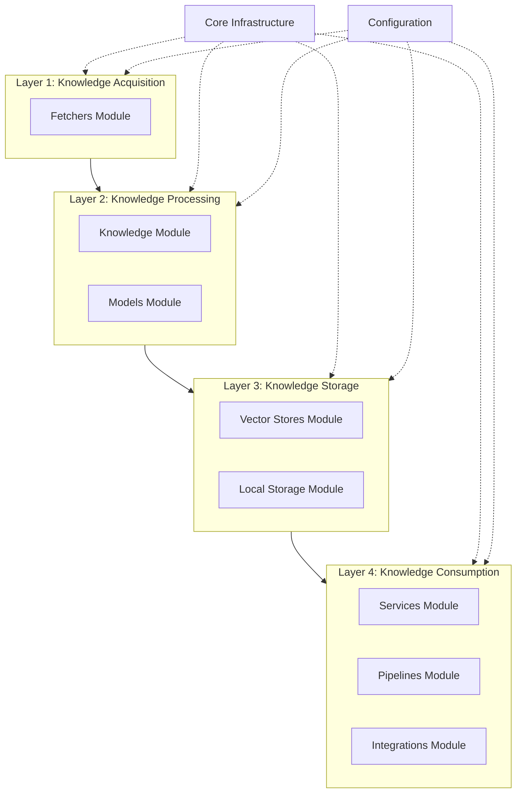
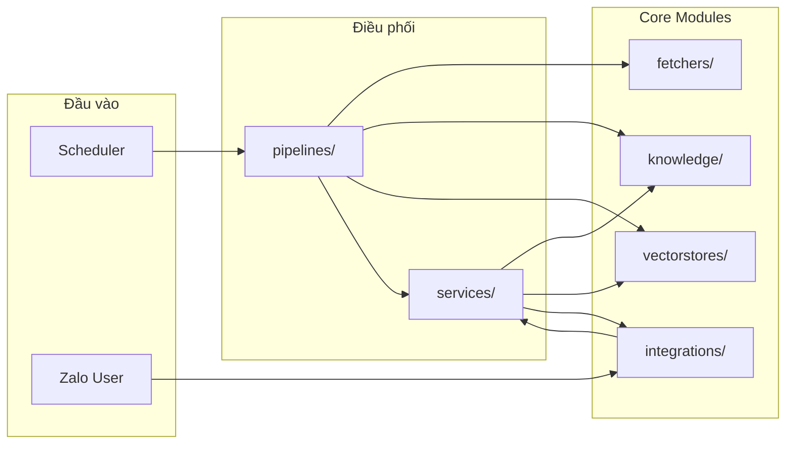

# High-Level Architecture

## Mục đích

Tài liệu này mô tả kiến trúc tổng thể của AI-Radar ở mức High-Level. Khác với System Context chỉ xác định ranh giới và tác nhân bên ngoài, High-Level Architecture đi sâu vào cấu trúc nội tại của hệ thống, bao gồm các tầng chức năng (Layers), các khối xử lý chính (Components) và cách chúng phối hợp để hiện thực hóa hai Pipeline cốt lõi: Knowledge Update và Question Answering.

Kiến trúc này tuân thủ tuyệt đối các nguyên tắc đã nêu trong `principles.md` và phản ánh đúng thiết kế Module trong Software Design Document (SDD).

## Kiến trúc phân tầng (Layered Architecture)

AI-Radar được tổ chức theo mô hình 4 tầng chức năng (Functional Layers). Mỗi tầng chịu trách nhiệm cho một giai đoạn cụ thể trong vòng đời của tri thức, từ khi dữ liệu thô được thu thập đến khi trở thành câu trả lời cho người dùng.

### Layer 1: Knowledge Acquisition (Thu thập tri thức)
Đây là tầng đầu vào của hệ thống, chịu trách nhiệm kết nối với thế giới bên ngoài để thu thập dữ liệu thô.
- **Thành phần chính:** `fetchers/`
- **Trách nhiệm:** Kết nối tới RSS Feeds, GitHub API, Hugging Face, Hacker News... để lấy Raw Article.
- **Đặc điểm:** Chỉ thực hiện I/O operations, không chứa logic xử lý tri thức. Tuân thủ nguyên tắc *Asynchronous by Default*.

### Layer 2: Knowledge Processing (Xử lý tri thức)
Tầng quan trọng nhất, nơi dữ liệu thô được chuyển đổi thành Knowledge Object có cấu trúc.
- **Thành phần chính:** `knowledge/`, `models/`
- **Trách nhiệm:** Cleaning, Normalization, Summarization, Keyword Extraction, Topic Classification.
- **Đặc điểm:** Là nơi duy nhất gọi LLM trong quá trình cập nhật dữ liệu (Knowledge Extraction). Tạo ra Single Source of Truth cho hệ thống.

### Layer 3: Knowledge Storage (Lưu trữ tri thức)
Tầng chịu trách nhiệm lưu trữ và quản lý các biểu diễn vector của tri thức.
- **Thành phần chính:** `vectorstores/`, `storage/`
- **Trách nhiệm:** Embedding Knowledge Object, Upsert vào Qdrant, quản lý Cache và History cục bộ.
- **Đặc điểm:** Đóng vai trò là Semantic Knowledge Repository. Không lưu Raw Article.

### Layer 4: Knowledge Consumption (Khai thác tri thức)
Tầng điều phối nghiệp vụ và tương tác với người dùng.
- **Thành phần chính:** `services/`, `pipelines/`, `integrations/`
- **Trách nhiệm:** 
  - `services/`: Chứa Business Logic (Digest Service, RAG Service).
  - `pipelines/`: Điều phối luồng xử lý (Update Pipeline, QA Pipeline).
  - `integrations/`: Giao tiếp với Groq (LLM) và Zalo (Notification/Bot).
- **Đặc điểm:** Tái sử dụng Knowledge Object từ Layer 3 cho cả Daily Digest và RAG.

## Dual Pipeline Architecture

AI-Radar vận hành dựa trên hai Pipeline độc lập, chia sẻ chung Knowledge Base nhưng khác biệt về vòng đời kích hoạt và mục tiêu xử lý.

### 1. Knowledge Update Pipeline (Scheduled)
Pipeline này chạy định kỳ (ví dụ: 06:00 sáng hàng ngày) để cập nhật tri thức mới.

**Luồng xử lý:**
1. **Trigger:** Scheduler kích hoạt.
2. **Acquisition:** `fetchers/` thu thập Raw Articles từ nhiều nguồn.
3. **Processing:** `knowledge/` chuẩn hóa, tóm tắt và trích xuất thông tin thành Knowledge Objects.
4. **Storage:** `vectorstores/` tạo Embedding và lưu vào Qdrant.
5. **Digestion:** `services/digest_service.py` tổng hợp Daily Digest từ các Knowledge Objects mới.
6. **Notification:** `integrations/zalo/` gửi bản tin qua Zalo OA.

**Đặc điểm kiến trúc:**
- Chạy bất đồng bộ, không yêu cầu phản hồi tức thời.
- Tập trung vào chất lượng dữ liệu đầu vào cho Knowledge Base.

### 2. Question Answering Pipeline (Interactive)
Pipeline này chạy khi người dùng đặt câu hỏi qua Zalo Bot.

**Luồng xử lý:**
1. **Trigger:** Webhook từ Zalo OA.
2. **Retrieval:** `services/rag_service.py` tiếp nhận câu hỏi, gọi `vectorstores/retriever.py` để tìm kiếm các Knowledge Objects liên quan.
3. **Generation:** `integrations/groq/` sử dụng LLM để sinh câu trả lời dựa trên Context retrieved.
4. **Response:** `integrations/zalo/` gửi câu trả lời lại cho người dùng.

**Đặc điểm kiến trúc:**
- Yêu cầu độ trễ thấp (Low Latency).
- Không thực hiện Crawl hay Embedding trong thời gian thực.
- Phụ thuộc hoàn toàn vào chất lượng Knowledge Base đã được xây dựng từ Update Pipeline.

## Component Interaction Map

Sơ đồ dưới đây mô tả cách các Module chính trong `app/` tương tác với nhau thông qua tầng Services và Pipelines.

**Giải thích tương tác:**
- **Pipelines** đóng vai trò là "khung xương" quy định trình tự gọi các Module.
- **Services** đóng vai trò là "bộ não" chứa logic nghiệp vụ phức tạp (ví dụ: cách chọn bài cho Digest, cách xây dựng Prompt cho RAG).
- **Core Modules** (`fetchers`, `knowledge`, `vectorstores`) là các công cụ thuần túy, không biết về nghiệp vụ tổng thể.

## Nguyên tắc phụ thuộc (Dependency Principles)

Để đảm bảo tính *Loose Coupling* và *Separation of Responsibility*, kiến trúc AI-Radar tuân thủ các quy tắc phụ thuộc sau:

1. **Hướng phụ thuộc:** Từ trên xuống dưới (Pipelines $\rightarrow$ Services $\rightarrow$ Core Modules).
2. **Không phụ thuộc ngược:** 
   - `fetchers/` không được gọi `services/`.
   - `knowledge/` không được gọi `vectorstores/` trực tiếp (mà thông qua Service hoặc Pipeline).
   - `integrations/` không chứa Business Logic.
3. **Abstraction Layer:** 
   - `vectorstores/` đóng vai trò trừu tượng hóa cho Qdrant.
   - `integrations/groq/` đóng vai trò trừu tượng hóa cho LLM Provider.
   - Giúp dễ dàng thay thế hạ tầng mà không ảnh hưởng đến Logic nghiệp vụ.

## Kết luận

High-Level Architecture của AI-Radar được thiết kế để tách biệt rõ ràng giữa quá trình **xây dựng tri thức** (Update Pipeline) và **khai thác tri thức** (QA Pipeline). Việc sử dụng mô hình phân tầng và Dual Pipeline giúp hệ thống đạt được sự cân bằng giữa hiệu năng xử lý batch lớn và độ trễ thấp khi tương tác với người dùng, đồng thời giữ vững nguyên tắc *Knowledge-Centric* với Knowledge Object làm trung tâm.