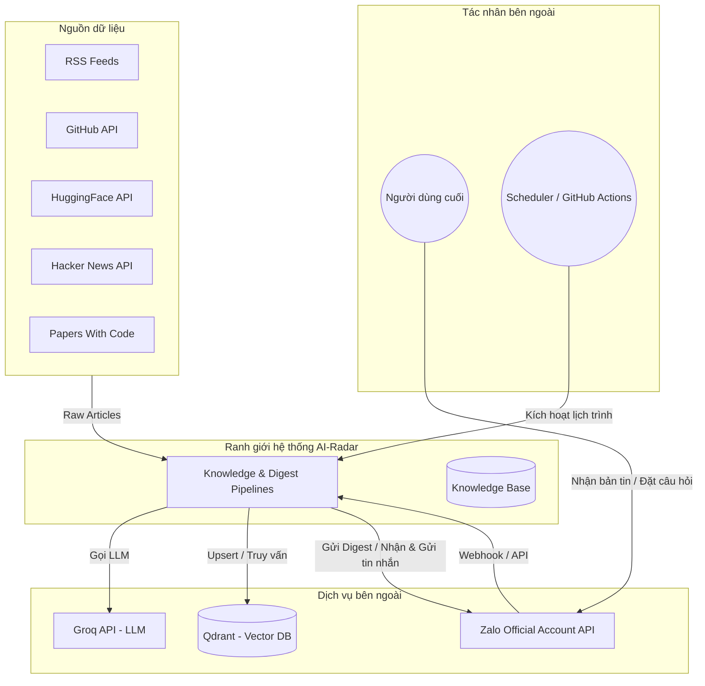

# System Context

## Mục đích

Tài liệu này xác định bối cảnh hoạt động của AI-Radar, bao gồm các tác nhân bên ngoài, hệ thống thứ cấp và môi trường mà AI-Radar tương tác. 

Mục tiêu là thiết lập một ranh giới rõ ràng (System Boundary) giữa những gì thuộc về lõi của AI-Radar và những gì là thành phần bên ngoài. Đây là cơ sở để thiết kế High-Level Architecture và xác định các luồng dữ liệu (Data Flow) ở các tài liệu tiếp theo.

## Bối cảnh hoạt động

AI-Radar hoạt động như một hệ thống Knowledge Intelligence tự động. Hệ thống không yêu cầu sự can thiệp thủ công trong quá trình thu thập và xử lý tri thức hàng ngày, nhưng lại tương tác trực tiếp với người dùng cuối thông qua kênh nhắn tin.

Hệ thống tồn tại trong một môi trường phân tán nhẹ, nơi các tác vụ I/O (thu thập dữ liệu, gọi LLM, lưu trữ vector, gửi tin nhắn) được thực hiện thông qua việc tích hợp với các dịch vụ bên ngoài. AI-Radar đóng vai trò là trung tâm điều phối và xử lý tri thức.

## Các tác nhân bên ngoài (External Actors)

### 1. Nguồn dữ liệu (Data Sources)
Đây là các hệ thống cung cấp dữ liệu thô (Raw Article) đầu vào cho AI-Radar. AI-Radar chỉ đóng vai trò là người tiêu thụ (Consumer) chủ động đối với các nguồn này.
- **RSS Feeds:** Các blog công nghệ, AI (ví dụ: LangChain Blog, Anthropic, OpenAI).
- **API công khai:** 
  - GitHub (Trending Repositories).
  - Hugging Face (New Models, Datasets).
  - Hacker News (AI-related discussions).
  - Papers With Code (Research papers).

*Đặc điểm kiến trúc:* Các nguồn này không biết đến sự tồn tại của AI-Radar. Việc thu thập hoàn toàn chủ động từ phía AI-Radar thông qua tầng `fetchers/`. Fetcher chỉ nhận dữ liệu và không yêu cầu nguồn dữ liệu phải cấu hình bất kỳ webhook hay kết nối ngược nào.

### 2. Dịch vụ hạ tầng & AI (Infrastructure & AI Services)
Các dịch vụ bên ngoài cung cấp khả năng tính toán, lưu trữ và xử lý ngôn ngữ tự nhiên cho AI-Radar.
- **Groq API (LLM Provider):** Cung cấp khả năng suy luận để thực hiện Knowledge Extraction (Summary, Keyword Extraction, Topic Classification) và Question Answering.
- **Qdrant (Vector Database):** Đóng vai trò là Semantic Knowledge Repository, lưu trữ Embedding và Metadata của Knowledge Object.

*Đặc điểm kiến trúc:* Đây là các thành phần hạ tầng cốt lõi. AI-Radar giao tiếp với chúng thông qua các lớp trừu tượng hóa (`integrations/`, `vectorstores/`) để đảm bảo nguyên tắc *Replaceable Infrastructure*. Business Logic không phụ thuộc trực tiếp vào implementation của Groq hay Qdrant.

### 3. Kênh tương tác (Interaction Channels)
Các nền tảng trung gian kết nối AI-Radar với người dùng cuối.
- **Zalo Official Account (OA):** 
  - Là kênh phân phối Daily Digest (Chủ động).
  - Là kênh tiếp nhận câu hỏi và phản hồi câu trả lời từ người dùng (Bị động/Interactive).

*Đặc điểm kiến trúc:* Zalo OA đóng vai trò là Adapter. AI-Radar không quản lý người dùng cuối trên Zalo, mà chỉ gửi/nhận tin nhắn thông qua Webhook và API. Tầng `integrations/zalo/` chịu trách nhiệm chuyển đổi định dạng tin nhắn giữa AI-Radar và Zalo.

### 4. Tác nhân kích hoạt (Trigger Actors)
- **Scheduler (GitHub Actions / Cron Job):** Tác nhân kích hoạt Knowledge Update Pipeline và Daily Digest Pipeline theo lịch trình cấu hình (ví dụ: 06:00 sáng hàng ngày).

*Đặc điểm kiến trúc:* Scheduler không truyền dữ liệu, chỉ gửi tín hiệu thực thi (Execution Trigger). Tầng `core/scheduler` hoặc môi trường triển khai sẽ lắng nghe tín hiệu này để khởi động Pipeline.

## Người dùng hệ thống (System Users)

- **Người dùng cuối (End User):** 
  - Nhận bản tin Daily AI Intelligence qua Zalo.
  - Đặt câu hỏi về tri thức AI qua Zalo Bot và nhận câu trả lời dựa trên Knowledge Base.
  
*Lưu ý:* AI-Radar không có hệ thống quản lý người dùng (User Management) hay phân quyền (Authentication/Authorization) trong phiên bản đầu tiên. Người dùng tương tác với hệ thống thông qua định danh của nền tảng Zalo. Hệ thống không lưu trữ trạng thái hội thoại (session) của người dùng.

## Sơ đồ ngữ cảnh (Context Diagram)

## Ranh giới hệ thống (System Boundaries)

| Thành phần | Vị trí | Trách nhiệm |
|---|---|---|
| **Fetchers** | Bên trong | Thu thập dữ liệu từ Nguồn dữ liệu. |
| **Knowledge Processing** | Bên trong | Chuyển đổi Raw Article thành Knowledge Object. |
| **Pipelines & Services** | Bên trong | Điều phối luồng dữ liệu và nghiệp vụ. |
| **Knowledge Base (Qdrant)** | Bên ngoài | Lưu trữ Vector và Metadata. |
| **Groq API** | Bên ngoài | Cung cấp khả năng xử lý ngôn ngữ tự nhiên. |
| **Zalo OA API** | Bên ngoài | Cung cấp kênh giao tiếp với người dùng. |
| **Scheduler** | Bên ngoài | Kích hoạt các tác vụ định kỳ. |
| **Người dùng** | Bên ngoài | Tiêu thụ tri thức và đặt câu hỏi. |

## Kết luận

System Context xác định rõ AI-Radar là một hệ thống trung tâm, chủ động thu thập dữ liệu từ nhiều nguồn, xử lý thông qua các dịch vụ AI bên ngoài, lưu trữ vào Vector Database và phân phối kết quả qua nền tảng nhắn tin. 

Việc tách biệt rõ ràng các tác nhân bên ngoài giúp kiến trúc của AI-Radar tập trung vào luồng xử lý tri thức bên trong (Knowledge-Centric), đồng thời đảm bảo khả năng thay thế hạ tầng (Replaceable Infrastructure) và mở rộng nguồn dữ liệu (Extensibility) trong tương lai mà không làm ảnh hưởng đến lõi nghiệp vụ.