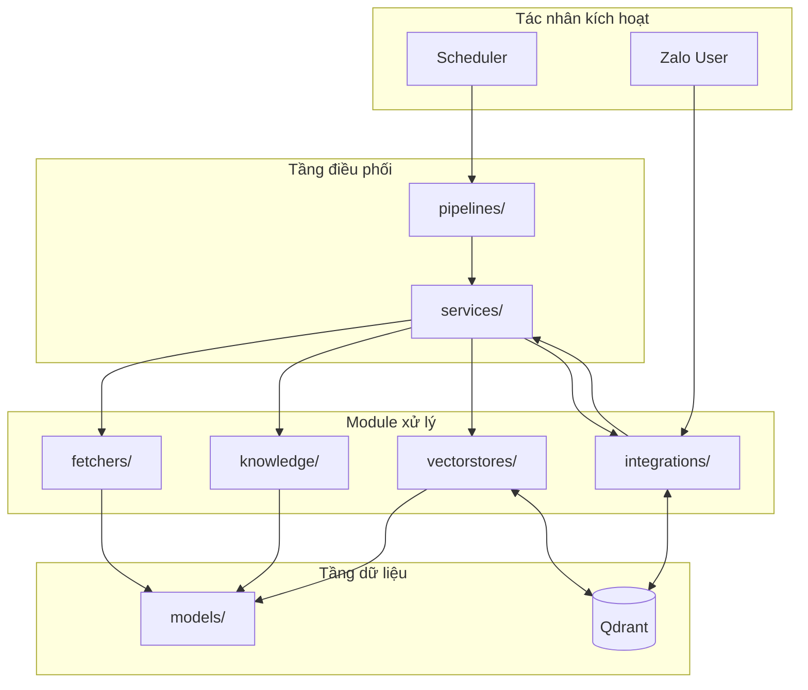

# Component Interaction

## Mục đích

Tài liệu này mô tả sự tương tác (Interaction) giữa các thành phần chính của AI-Radar trong quá trình thực thi. Khác với Module Responsibilities tập trung vào trách nhiệm tĩnh, Component Interaction đi sâu vào động thái phối hợp giữa các module khi hệ thống hoạt động.

Mục tiêu là làm rõ cách dữ liệu di chuyển qua các tầng kiến trúc và cách các service điều phối các module con để hoàn thành nghiệp vụ.

## Nguyên tắc tương tác

Toàn bộ sự tương tác trong AI-Radar tuân thủ các nguyên tắc sau:
1. **Điều phối tập trung:** Mọi luồng xử lý phức tạp đều được điều phối bởi `services/` hoặc `pipelines/`.
2. **Giao tiếp qua Interface:** Các module cốt lõi (`fetchers`, `knowledge`, `vectorstores`) giao tiếp thông qua các đối tượng dữ liệu chuẩn (`models/`).
3. **Không phụ thuộc chéo trực tiếp:** Các module cùng tầng không gọi trực tiếp lẫn nhau mà phải thông qua tầng điều phối hoặc service chung.

## Sơ đồ tương tác tổng thể

Sơ đồ dưới đây minh họa mối quan hệ điều phối giữa các thành phần chính trong hai Pipeline cốt lõi.

## Luồng cập nhật tri thức (Knowledge Update Flow)

Đây là luồng xử lý chạy định kỳ, chịu trách nhiệm biến dữ liệu thô thành tri thức có cấu trúc.

**Trình tự tương tác:**
1. **Kích hoạt:** `Scheduler` gửi tín hiệu đến `KnowledgeUpdatePipeline`.
2. **Thu thập:** Pipeline gọi `Fetchers` để lấy danh sách `RawArticle` từ các nguồn (RSS, GitHub, v.v.).
3. **Xử lý:** Pipeline chuyển `RawArticle` sang `KnowledgeService`. Service này gọi `KnowledgeProcessor` để làm sạch, tóm tắt và trích xuất metadata, tạo ra `KnowledgeObject`.
4. **Lưu trữ:** `KnowledgeService` gọi `VectorStoreService` để tạo Embedding và upsert `KnowledgeObject` vào Qdrant.
5. **Tổng hợp:** Sau khi cập nhật xong, `DigestService` được gọi để truy vấn các bài mới nhất từ Qdrant và sinh nội dung Daily Digest.
6. **Thông báo:** `DigestService` chuyển nội dung sang `ZaloIntegration` để gửi bản tin tới người dùng.

**Điểm nhấn kiến trúc:**
- Luồng này hoàn toàn bất đồng bộ và không yêu cầu phản hồi tức thời.
- `KnowledgeObject` là sản phẩm cuối cùng của luồng này và trở thành tài sản chung cho mọi chức năng khác.

## Luồng truy vấn tri thức (Question Answering Flow)

Đây là luồng xử lý chạy interactive, chịu trách nhiệm trả lời câu hỏi của người dùng dựa trên kho tri thức đã có.

**Trình tự tương tác:**
1. **Tiếp nhận:** `ZaloIntegration` nhận Webhook chứa câu hỏi từ người dùng và chuyển sang `RAGService`.
2. **Truy xuất:** `RAGService` gọi `Retriever` (thuộc `vectorstores/`) để tìm kiếm các `KnowledgeObject` liên quan trong Qdrant dựa trên embedding của câu hỏi.
3. **Sinh câu trả lời:** `RAGService` xây dựng Prompt Context từ kết quả truy xuất và gọi `GroqIntegration` (LLM) để sinh câu trả lời.
4. **Phản hồi:** Câu trả lời được định dạng lại và chuyển ngược về `ZaloIntegration` để gửi tới người dùng.

**Điểm nhấn kiến trúc:**
- Luồng này tuyệt đối không thực hiện crawl hay embedding mới.
- Độ trễ thấp nhờ việc tái sử dụng `KnowledgeObject` đã được chuẩn bị sẵn từ Knowledge Update Flow.

## Tương tác với dịch vụ bên ngoài

AI-Radar giao tiếp với ba dịch vụ bên ngoài chính thông qua lớp `integrations/`:

| Dịch vụ | Module tích hợp | Vai trò tương tác |
|---|---|---|
| **Groq API** | `integrations/groq/` | Cung cấp khả năng suy luận cho Knowledge Extraction và Question Answering. |
| **Qdrant** | `vectorstores/qdrant.py` | Lưu trữ và truy xuất Semantic Knowledge. |
| **Zalo OA** | `integrations/zalo/` | Kênh giao tiếp hai chiều: nhận câu hỏi và phân phối bản tin. |

**Nguyên tắc tích hợp:**
- Mọi lỗi từ dịch vụ bên ngoài đều được bắt và xử lý tại tầng Integration hoặc Service, đảm bảo không làm sập toàn bộ ứng dụng.
- Thông tin xác thực (API Keys) được quản lý tập trung trong `config/` và không bao giờ xuất hiện trong logic tương tác.

## Kết luận

Sự tương tác giữa các thành phần trong AI-Radar được thiết kế theo mô hình "Hub-and-Spoke", trong đó `services/` đóng vai trò là trung tâm điều phối, kết nối các module chuyên biệt (`fetchers`, `knowledge`, `vectorstores`) lại với nhau. 

Cách tổ chức này giúp hệ thống đạt được sự cân bằng giữa tính đơn giản trong từng module riêng lẻ và sự linh hoạt trong việc phối hợp để giải quyết các nghiệp vụ phức tạp như RAG hay Daily Digest generation.