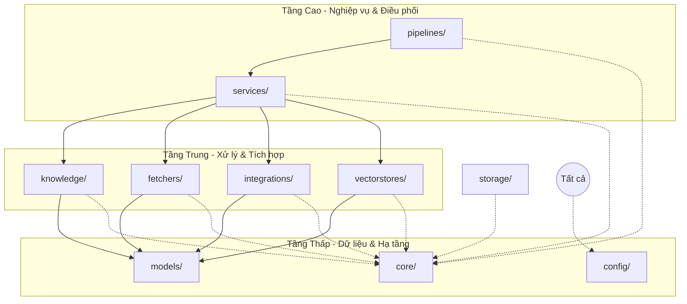

# Dependency Rules

## Mục đích

Tài liệu này xác định các quy tắc phụ thuộc (Dependency Rules) giữa các package trong hệ thống AI-Radar. Khác với Module Responsibilities tập trung vào trách nhiệm nghiệp vụ, Dependency Rules tập trung vào cấu trúc tĩnh và hướng dòng chảy của sự phụ thuộc (Direction of Dependency).

Việc tuân thủ nghiêm ngặt các quy tắc này giúp hệ thống đạt được:
- **Low Coupling:** Giảm thiểu sự ràng buộc giữa các thành phần.
- **High Cohesion:** Các module chỉ phụ thuộc vào những gì thực sự cần thiết cho trách nhiệm của chúng.
- **Testability:** Dễ dàng Mock hoặc Stub các dependency khi viết Unit Test.
- **Maintainability:** Thay đổi một module ở tầng dưới không gây ra hiệu ứng domino lên toàn bộ hệ thống.

## Nguyên tắc chung: Phụ thuộc một chiều (Unidirectional Dependency)

Toàn bộ hệ thống AI-Radar tuân theo mô hình phụ thuộc phân tầng (Layered Dependency). Hướng phụ thuộc luôn đi từ trên xuống dưới, từ tầng nghiệp vụ (Business Logic) về tầng hạ tầng (Infrastructure) và dữ liệu (Data).

**Quy tắc vàng:**
1. Một package ở tầng cao hơn có thể phụ thuộc vào package ở tầng thấp hơn.
2. Một package ở tầng thấp hơn **tuyệt đối không** được phụ thuộc vào package ở tầng cao hơn.
3. Các package cùng tầng nên hạn chế phụ thuộc trực tiếp vào nhau; nếu cần giao tiếp, hãy thông qua một Service hoặc Interface chung.

## Chi tiết quy tắc phụ thuộc

### 1. Quy tắc cho `pipelines/` (Orchestration Layer)
- **Được phép phụ thuộc vào:** `services/`, `core/`, `config/`.
- **Không được phép phụ thuộc vào:** `fetchers/`, `knowledge/`, `vectorstores/`, `integrations/` một cách trực tiếp.
- **Lý do:** Pipeline chỉ đóng vai trò điều phối trình tự. Chi tiết xử lý nằm trong Services. Việc gọi trực tiếp các module core sẽ làm Pipeline trở nên cồng kềnh và khó thay đổi luồng nghiệp vụ.

### 2. Quy tắc cho `services/` (Business Logic Layer)
- **Được phép phụ thuộc vào:** `fetchers/`, `knowledge/`, `vectorstores/`, `integrations/`, `storage/`, `models/`, `core/`, `config/`.
- **Không được phép phụ thuộc vào:** `pipelines/`.
- **Lý do:** Service chứa logic nghiệp vụ cụ thể. Nó cần gọi các module con để hoàn thành nhiệm vụ nhưng không được biết về cách các Service khác được kết nối trong Pipeline.

### 3. Quy tắc cho `knowledge/`, `fetchers/`, `vectorstores/`, `integrations/` (Core Modules)
- **Được phép phụ thuộc vào:** `models/`, `core/`, `config/`.
- **Không được phép phụ thuộc vào:** `services/`, `pipelines/`, hoặc lẫn nhau (ví dụ: `fetchers` không gọi `knowledge`).
- **Lý do:** Đây là các module "công cụ" thuần túy. Chúng nhận đầu vào, xử lý và trả về kết quả theo định dạng `models/`. Việc phụ thuộc chéo giữa các module này sẽ phá vỡ nguyên tắc *Single Responsibility*.

### 4. Quy tắc cho `models/` (Data Layer)
- **Không được phép phụ thuộc vào bất kỳ module nào khác.**
- **Lý do:** Data Model phải độc lập hoàn toàn để có thể được sử dụng bởi mọi tầng mà không gây ra vòng lặp phụ thuộc (Circular Dependency).

### 5. Quy tắc cho `core/` và `config/` (Infrastructure Layer)
- **Không được phép phụ thuộc vào bất kỳ module nghiệp vụ nào** (`services`, `pipelines`, `knowledge`, v.v.).
- **Lý do:** Hạ tầng và cấu hình là nền tảng. Nếu `logger.py` lại phải import `services/`, hệ thống sẽ không thể khởi động đúng cách và vi phạm nguyên tắc tách biệt hạ tầng.

### 6. Quy tắc cho `storage/` (Local Data)
- **Được phép phụ thuộc vào:** `models/`, `core/`.
- **Không được phép phụ thuộc vào:** `vectorstores/` (vì Qdrant đã đóng vai trò là Knowledge Base chính).

## Quản lý phụ thuộc vòng (Circular Dependencies)

AI-Radar nghiêm cấm mọi dạng phụ thuộc vòng.

**Ví dụ vi phạm:**
- `service_a.py` import `service_b.py`
- `service_b.py` import `service_a.py`

**Cách xử lý:**
1. **Tách Logic chung:** Đưa phần logic bị trùng lặp hoặc phụ thuộc lẫn nhau vào một Service mới hoặc một Helper trong `core/`.
2. **Sử dụng Interface/Abstract Class:** Định nghĩa một interface trong `models/` hoặc `core/` để hai module giao tiếp thông qua contract thay vì implementation cụ thể.
3. **Dependency Injection:** Truyền dependency vào qua constructor hoặc tham số hàm thay vì import trực tiếp ở đầu file.

## Kiểm tra phụ thuộc (Dependency Checking)

Trong quá trình phát triển, cần đảm bảo:
1. Không có câu lệnh `import` nào đi ngược chiều mũi tên trong sơ đồ phụ thuộc.
2. Các module trong `app/` không import lẫn nhau theo kiểu "ngang hàng" nếu không có lý do chính đáng về mặt kiến trúc.
3. Mọi sự thay đổi cấu trúc thư mục đều phải được cập nhật lại quy tắc phụ thuộc trong tài liệu này trước khi implement.

## Kết luận

Hệ thống phụ thuộc của AI-Radar được thiết kế theo hình tháp, với `models/` và `core/` làm nền móng vững chắc, `services/` làm trụ cột nghiệp vụ và `pipelines/` làm mái che điều phối. Việc tuân thủ strict dependency rules giúp mã nguồn luôn sạch sẽ, dễ đọc và dễ dàng mở rộng khi thêm mới các nguồn dữ liệu hoặc kênh tích hợp trong tương lai.