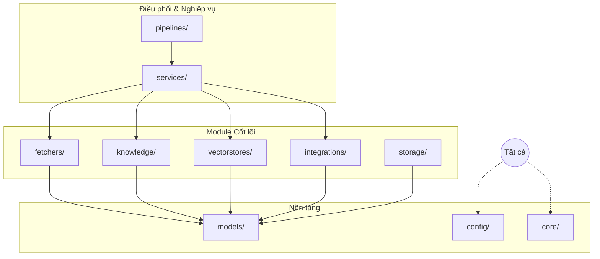

# Module Responsibilities

## Mục đích

Tài liệu này xác định rõ trách nhiệm (Responsibilities) của từng nhóm module trong hệ thống AI-Radar. Khác với Package Structure tập trung vào việc tổ chức mã nguồn, Module Responsibilities đi sâu vào vai trò nghiệp vụ và kiến trúc của từng thành phần, giúp đảm bảo nguyên tắc *Single Responsibility* và *Separation of Concerns*.

Việc xác định rõ trách nhiệm giúp tránh tình trạng "God Module" (module đa năng), giảm sự phụ thuộc chéo và tạo điều kiện thuận lợi cho việc kiểm thử cũng như mở rộng hệ thống trong tương lai.

## Nguyên tắc phân chia trách nhiệm

Mỗi module trong AI-Radar được giao phó một nhiệm vụ duy nhất và rõ ràng. Sự phối hợp giữa các module được thực hiện thông qua tầng Orchestration (`pipelines/` và `services/`), đảm bảo rằng các module cốt lõi (`fetchers`, `knowledge`, `vectorstores`) luôn giữ tính độc lập và có thể tái sử dụng.

## Chi tiết trách nhiệm của từng Module

### 1. config/ (Configuration)
**Trách nhiệm chính:** Quản lý toàn bộ thông tin cấu hình và hằng số của hệ thống.
- **Đảm nhận:** 
  - Lưu trữ API Keys, Endpoints, Scheduler Time.
  - Định nghĩa Prompt Templates cho LLM.
  - Cấu hình tham số vận hành (Top-K, Chunk Size, v.v.).
- **Không đảm nhận:** Business Logic hoặc xử lý dữ liệu.
- **Đầu vào:** Environment Variables hoặc file cấu hình.
- **Đầu ra:** Các đối tượng cấu hình (Settings/Constants) cho các module khác sử dụng.

### 2. core/ (Core Infrastructure)
**Trách nhiệm chính:** Cung cấp các tiện ích hạ tầng dùng chung.
- **Đảm nhận:** 
  - Logging hệ thống.
  - Xử lý ngoại lệ (Exception Handling).
  - Tiện ích chung (Utils) như date formatting, string cleaning.
  - Interface cho Scheduler.
- **Không đảm nhận:** Logic nghiệp vụ hoặc giao tiếp với dịch vụ bên ngoài.
- **Đầu vào:** Yêu cầu từ các module khác.
- **Đầu ra:** Logs, Utility Functions, Error Objects.

### 3. models/ (Data Models)
**Trách nhiệm chính:** Định nghĩa cấu trúc dữ liệu chuẩn của hệ thống.
- **Đảm nhận:** 
  - Định nghĩa `RawArticle`, `KnowledgeObject`, `Digest`, `Response`.
  - Đảm bảo tính nhất quán về kiểu dữ liệu giữa các module.
- **Không đảm nhận:** Logic xử lý hoặc lưu trữ.
- **Đầu vào:** Dữ liệu thô hoặc kết quả xử lý.
- **Đầu ra:** Các đối tượng dữ liệu có cấu trúc (Typed Objects).

### 4. fetchers/ (Knowledge Acquisition)
**Trách nhiệm chính:** Thu thập dữ liệu thô từ các nguồn bên ngoài.
- **Đảm nhận:** 
  - Kết nối tới RSS, GitHub, HuggingFace, Hacker News.
  - Parse dữ liệu và chuẩn hóa định dạng ban đầu.
  - Trả về danh sách `RawArticle`.
- **Không đảm nhận:** Tóm tắt, trích xuất tri thức hoặc embedding.
- **Đầu vào:** Cấu hình nguồn dữ liệu.
- **Đầu ra:** List<RawArticle>.

### 5. knowledge/ (Knowledge Processing)
**Trách nhiệm chính:** Chuyển đổi Raw Article thành Knowledge Object.
- **Đảm nhận:** 
  - Cleaning và Normalization văn bản.
  - Gọi LLM để Summarize, Extract Keywords, Classify Topics.
  - Lắp ráp thông tin thành `KnowledgeObject`.
- **Không đảm nhận:** Lưu trữ vào Database hoặc gọi API Zalo.
- **Đầu vào:** RawArticle.
- **Đầu ra:** KnowledgeObject.

### 6. vectorstores/ (Semantic Storage)
**Trách nhiệm chính:** Quản lý lưu trữ và truy xuất tri thức ngữ nghĩa.
- **Đảm nhận:** 
  - Tạo Embedding cho Knowledge Object.
  - Upsert dữ liệu vào Qdrant.
  - Thực hiện Semantic Search (Retrieval) dựa trên câu hỏi.
- **Không đảm nhận:** Xử lý logic nghiệp vụ hoặc gọi LLM trực tiếp.
- **Đầu vào:** KnowledgeObject hoặc User Question.
- **Đầu ra:** List<KnowledgeObject> (từ Retrieval) hoặc Status (từ Upsert).

### 7. storage/ (Local Storage)
**Trách nhiệm chính:** Quản lý dữ liệu cục bộ phục vụ vận hành.
- **Đảm nhận:** 
  - Lưu trữ History, Cache và Temporary Data.
  - Quản lý file JSON hoặc SQLite cục bộ.
- **Không đảm nhận:** Lưu trữ tri thức chính (vai trò này thuộc về Qdrant).
- **Đầu vào:** Dữ liệu cần lưu tạm thời.
- **Đầu ra:** Dữ liệu đã lưu hoặc truy xuất từ local.

### 8. services/ (Business Logic)
**Trách nhiệm chính:** Điều phối các module con để hoàn thành nghiệp vụ phức tạp.
- **Đảm nhận:** 
  - `DigestService`: Tổng hợp Daily Digest từ nhiều Knowledge Objects.
  - `RAGService`: Xây dựng Prompt Context từ Retrieval Result và gọi LLM để sinh câu trả lời.
  - `KnowledgeService`: Quản lý vòng đời của Knowledge Object.
- **Không đảm nhận:** Giao tiếp trực tiếp với API bên ngoài (Zalo/Groq) mà phải thông qua `integrations/`.
- **Đầu vào:** Yêu cầu nghiệp vụ (ví dụ: "Tạo digest cho ngày hôm nay").
- **Đầu ra:** Kết quả nghiệp vụ (ví dụ: Nội dung Digest hoặc Câu trả lời RAG).

### 9. pipelines/ (Orchestration)
**Trách nhiệm chính:** Định nghĩa trình tự thực thi của các luồng xử lý.
- **Đảm nhận:** 
  - `KnowledgeUpdatePipeline`: Chạy theo lịch, gọi Fetcher $\rightarrow$ Knowledge $\rightarrow$ VectorStore.
  - `QuestionAnsweringPipeline`: Chạy khi có request, gọi Service $\rightarrow$ Integration.
- **Không đảm nhận:** Chi tiết xử lý dữ liệu (việc này nằm trong Services và Core Modules).
- **Đầu vào:** Trigger (Scheduler hoặc Webhook).
- **Đầu ra:** Trạng thái hoàn thành của Pipeline.

### 10. integrations/ (Integration Adapters)
**Trách nhiệm chính:** Giao tiếp với các dịch vụ bên ngoài không thuộc nhóm thu thập dữ liệu.
- **Đảm nhận:** 
  - `GroqClient`: Gửi Prompt và nhận Response từ LLM.
  - `ZaloClient`: Gửi tin nhắn và nhận Webhook từ Zalo OA.
- **Không đảm nhận:** Business Logic hoặc quyết định nội dung tin nhắn.
- **Đầu vào:** Dữ liệu đã được chuẩn bị bởi Services.
- **Đầu ra:** Phản hồi từ API bên ngoài.

## Ma trận trách nhiệm (Responsibility Matrix)

| Nhiệm vụ | Fetchers | Knowledge | VectorStores | Services | Integrations | Pipelines |
|---|---|---|---|---|---|---|
| **Crawl dữ liệu** | ✅ | ❌ | ❌ | ❌ | ❌ | ❌ |
| **Tóm tắt bài viết** | ❌ | ✅ | ❌ | ❌ | ❌ | ❌ |
| **Tạo Embedding** | ❌ | ❌ | ✅ | ❌ | ❌ | ❌ |
| **Lưu vào Qdrant** | ❌ | ❌ | ✅ | ❌ | ❌ | ❌ |
| **Gọi LLM (Query)** | ❌ | ❌ | ❌ | ✅ (Điều phối) | ✅ (Thực thi) | ❌ |
| **Gửi tin Zalo** | ❌ | ❌ | ❌ | ❌ | ✅ | ❌ |
| **Điều phối luồng** | ❌ | ❌ | ❌ | ❌ | ❌ | ✅ |

## Kết luận

Việc phân chia trách nhiệm rõ ràng giữa các module giúp AI-Radar đạt được sự cân bằng giữa tính đơn giản và khả năng mở rộng. Mỗi module đều có một "hợp đồng" rõ ràng về đầu vào và đầu ra, giúp quá trình phát triển và bảo trì hệ thống trở nên minh bạch và hiệu quả hơn.