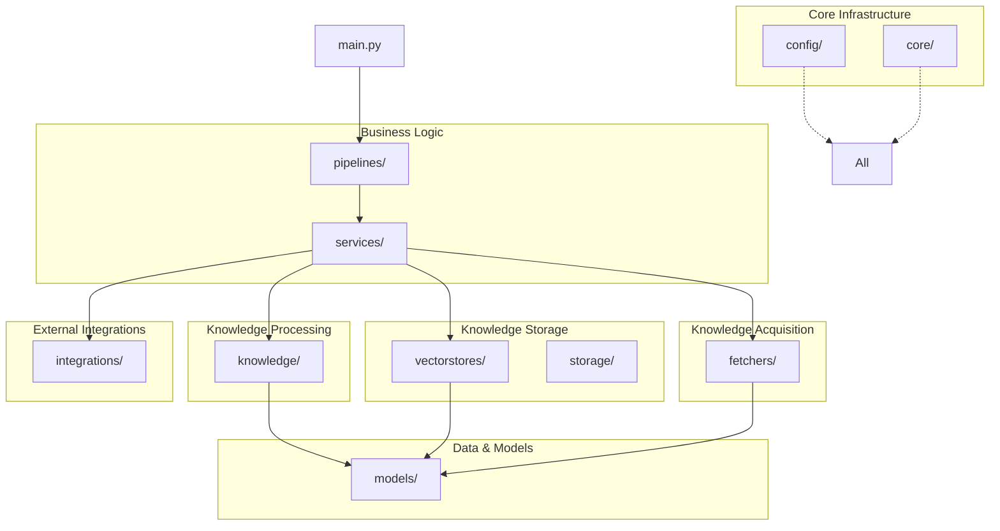

# Package Structure

## Mục đích

Tài liệu này mô tả cấu trúc các package (gói) trong hệ thống AI-Radar ở mức kiến trúc. Khác với Folder Structure Design tập trung vào việc tổ chức mã nguồn vật lý, Package Structure đi sâu vào việc phân chia trách nhiệm logic giữa các nhóm module, cách chúng được đóng gói và tương tác với nhau để hiện thực hóa kiến trúc Knowledge-Centric.

Mỗi package đại diện cho một nhóm chức năng có tính gắn kết cao (High Cohesion) và có ranh giới trách nhiệm rõ ràng.

## Nguyên tắc tổ chức Package

AI-Radar áp dụng nguyên tắc **Layer First** kết hợp với **Single Responsibility**. Các package được tổ chức theo các tầng chức năng thay vì theo tính năng nghiệp vụ cụ thể. Điều này giúp tối ưu hóa khả năng tái sử dụng giữa hai pipeline chính: Knowledge Update và Question Answering.

## Danh sách các Package chính

### 1. config/ (Configuration Package)
Chứa toàn bộ thông tin cấu hình và hằng số của hệ thống.
- **Trách nhiệm:** Quản lý API Keys, Scheduler Time, Prompt Templates, và các tham số vận hành.
- **Đặc điểm:** Không chứa Business Logic. Là nơi duy nhất định nghĩa các giá trị có thể thay đổi tùy theo môi trường triển khai.

### 2. core/ (Core Infrastructure Package)
Chứa các thành phần hạ tầng dùng chung cho toàn bộ ứng dụng.
- **Trách nhiệm:** Cung cấp Logger, Exception Handling, Utility Functions và Scheduler Interface.
- **Đặc điểm:** Các module khác phụ thuộc vào `core/` nhưng `core/` không phụ thuộc ngược lại vào bất kỳ module nghiệp vụ nào.

### 3. models/ (Data Models Package)
Định nghĩa các đối tượng dữ liệu (Domain Entities) của hệ thống.
- **Trách nhiệm:** Định nghĩa cấu trúc của `RawArticle`, `KnowledgeObject`, `Digest`, và `Response`.
- **Đặc điểm:** Chỉ chứa định nghĩa dữ liệu (Data Classes), không chứa logic xử lý. Đây là ngôn ngữ chung để các package giao tiếp với nhau.

### 4. fetchers/ (Knowledge Acquisition Package)
Chịu trách nhiệm thu thập dữ liệu từ các nguồn bên ngoài.
- **Trách nhiệm:** Kết nối tới RSS, GitHub, HuggingFace... để lấy Raw Article.
- **Đặc điểm:** Tuân thủ nguyên tắc *Asynchronous by Default*. Mỗi Fetcher là một adapter độc lập cho một nguồn dữ liệu cụ thể.

### 5. knowledge/ (Knowledge Processing Package)
Là "động cơ" chuyển đổi dữ liệu thô thành tri thức.
- **Trách nhiệm:** Thực hiện Cleaning, Normalization, Summarization, Keyword Extraction và Topic Classification.
- **Đặc điểm:** Là nơi duy nhất gọi LLM trong quá trình cập nhật dữ liệu. Đầu ra luôn là `KnowledgeObject`.

### 6. vectorstores/ (Semantic Storage Package)
Quản lý việc lưu trữ và truy xuất tri thức dưới dạng vector.
- **Trách nhiệm:** Tạo Embedding, Upsert vào Qdrant và thực hiện Semantic Retrieval.
- **Đặc điểm:** Đóng vai trò là lớp trừu tượng hóa cho Vector Database, giúp business logic không phụ thuộc trực tiếp vào Qdrant.

### 7. storage/ (Local Storage Package)
Quản lý dữ liệu cục bộ phục vụ vận hành.
- **Trách nhiệm:** Lưu trữ History, Cache và Temporary Data.
- **Đặc điểm:** Không phải là Knowledge Base chính. Dữ liệu ở đây có thể bị xóa hoặc ghi đè mà không ảnh hưởng đến tri thức cốt lõi.

### 8. services/ (Business Logic Package)
Chứa các dịch vụ nghiệp vụ điều phối nhiều module nhỏ.
- **Trách nhiệm:** `DigestService` (tạo bản tin), `RAGService` (trả lời câu hỏi), `KnowledgeService` (quản lý vòng đời tri thức).
- **Đặc điểm:** Service không trực tiếp gọi API bên ngoài mà thông qua `integrations/`.

### 9. pipelines/ (Orchestration Package)
Định nghĩa trình tự thực thi của các luồng xử lý.
- **Trách nhiệm:** `KnowledgeUpdatePipeline` và `QuestionAnsweringPipeline`.
- **Đặc điểm:** Pipeline chỉ quy định "ai làm trước, ai làm sau", còn chi tiết "làm như thế nào" nằm trong các Service và Module con.

### 10. integrations/ (Integration Adapters Package)
Cầu nối giữa hệ thống và các dịch vụ bên ngoài.
- **Trách nhiệm:** Giao tiếp với Groq API (LLM) và Zalo OA (Notification/Bot).
- **Đặc điểm:** Đóng vai trò là Adapter Pattern, giúp dễ dàng thay thế nhà cung cấp dịch vụ trong tương lai.

## Quan hệ giữa các Package

Các package trong AI-Radar tuân thủ nghiêm ngặt quy tắc phụ thuộc một chiều:

1. **Pipelines** phụ thuộc vào **Services**.
2. **Services** phụ thuộc vào **Core Modules** (`Fetchers`, `Knowledge`, `VectorStores`, `Integrations`).
3. **Core Modules** phụ thuộc vào **Models** và **Core Infrastructure**.
4. **Config** được sử dụng bởi mọi package nhưng không phụ thuộc vào package nào.

Việc tổ chức này đảm bảo rằng khi thay đổi một module ở tầng dưới (ví dụ: thay đổi cách Fetcher lấy dữ liệu), các module ở tầng trên (Services/Pipelines) sẽ không bị ảnh hưởng miễn là interface đầu ra vẫn giữ nguyên.

## Kết luận

Cấu trúc package của AI-Radar được thiết kế để phản ánh đúng kiến trúc Knowledge-Centric và Dual Pipeline. Việc phân chia rõ ràng giữa Acquisition, Processing, Storage và Consumption giúp hệ thống dễ dàng mở rộng nguồn dữ liệu mới hoặc thay đổi hạ tầng lưu trữ mà không cần viết lại toàn bộ logic nghiệp vụ.