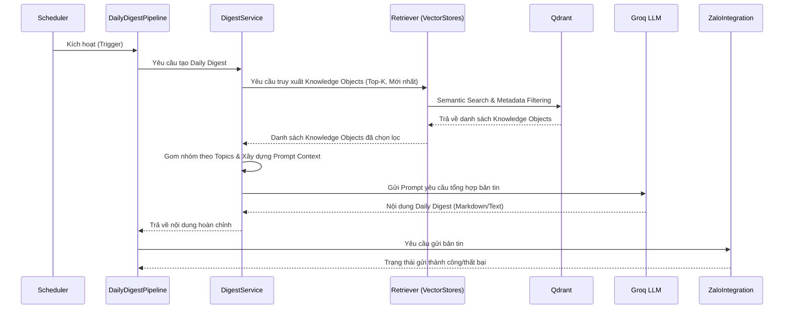

# Daily Digest Pipeline

## Mục đích

Tài liệu này mô tả chi tiết hành vi runtime của **Daily Digest Pipeline** trong hệ thống AI-Radar. 

Khác với Knowledge Update Pipeline (tập trung vào thu thập và xây dựng tri thức), Daily Digest Pipeline là một luồng xử lý chuyên biệt, có trách nhiệm duy nhất là **khai thác** Knowledge Base đã được cập nhật để tổng hợp thành một bản tin công nghệ (Daily Digest) và phân phối tới người dùng qua Zalo Official Account.

## Tổng quan Pipeline

Daily Digest Pipeline hiện thực hóa chức năng "Daily AI Intelligence" – tính năng cốt lõi và là lý do tồn tại của tên gọi AI-Radar. Pipeline này không tạo ra tri thức mới, mà đóng vai trò là một "biên tập viên tự động", chọn lọc và trình bày lại các Knowledge Object nổi bật.

**Đặc điểm nhận dạng:**
- **Cơ chế kích hoạt:** Chạy theo lịch (Scheduled), thường là sau khi Knowledge Update Pipeline hoàn tất (hoặc chạy độc lập vào một khung giờ cố định).
- **Mục tiêu:** Tổng hợp và phân phối bản tin AI hàng ngày.
- **Tính chất:** Read-only đối với Knowledge Base. Bất đồng bộ (Asynchronous).
- **Nguyên tắc cốt lõi:** Tuân thủ tuyệt đối nguyên tắc *Knowledge Reuse* và *Knowledge First*.

## Sơ đồ Sequence (Sequence Diagram)

Sơ đồ dưới đây minh họa trình tự tương tác giữa các thành phần để tạo ra và gửi bản tin.

## Chi tiết các bước thực thi

Luồng xử lý được điều phối bởi `pipelines/daily_digest.py` và `services/digest_service.py`, được chia thành 5 giai đoạn chính:

### 1. Kích hoạt (Triggering)
- **Thành phần:** `core/scheduler.py` $\rightarrow$ `pipelines/daily_digest.py`.
- **Hành động:** Scheduler gửi tín hiệu thực thi. Trong thiết kế hiện tại, Pipeline này có thể được kích hoạt nối tiếp ngay sau Knowledge Update Pipeline hoặc chạy độc lập theo một cron-job riêng.
- **Trạng thái:** Pipeline khởi tạo, sẵn sàng truy vấn Knowledge Base.

### 2. Truy xuất tri thức nổi bật (Knowledge Retrieval)
- **Thành phần:** `services/digest_service.py` $\rightarrow$ `vectorstores/retriever.py` $\rightarrow$ Qdrant.
- **Hành động:** 
  - `DigestService` yêu cầu `Retriever` lấy danh sách các `KnowledgeObject` mới được thêm vào trong ngày (dựa trên `published_at` hoặc `created_at`).
  - Áp dụng **Metadata Filtering** để lọc theo `importance_score` (ưu tiên các bài viết quan trọng) hoặc giới hạn số lượng (Top-K) để đảm bảo bản tin không quá dài.
- **Đầu ra:** `List<KnowledgeObject>` (chứa title, summary, topics, url...).
- **Lưu ý:** Tuyệt đối không truy cập Raw Article. Mọi dữ liệu đều lấy từ Knowledge Object.

### 3. Xây dựng ngữ cảnh & Gom nhóm (Context Building & Grouping)
- **Thành phần:** `services/digest_service.py`.
- **Hành động:** 
  - Phân loại và gom nhóm các `KnowledgeObject` theo `topics` (ví dụ: LLM, Computer Vision, MLOps).
  - Sắp xếp thứ tự ưu tiên dựa trên `importance_score`.
  - Lắp ráp các trường `summary` và `key_takeaways` thành một Prompt Context có cấu trúc.
- **Đầu ra:** Một Prompt Context hoàn chỉnh, sẵn sàng gửi cho LLM.

### 4. Sinh bản tin (Digest Generation)
- **Thành phần:** `services/digest_service.py` $\rightarrow$ `integrations/groq/client.py`.
- **Hành động:** 
  - Pipeline gửi Prompt Context tới Groq LLM.
  - LLM đóng vai trò "biên tập viên", đọc các summary và sinh ra một bản tin tổng hợp mạch lạc, hấp dẫn, có định dạng Markdown (hoặc text phù hợp với Zalo).
  - Bản tin bao gồm: Lời mở đầu, các mục tin tức theo chủ đề, và danh sách liên kết tham khảo (URL).
- **Đầu ra:** Nội dung Daily Digest hoàn chỉnh.

### 5. Định dạng & Phân phối (Formatting & Notification)
- **Thành phần:** `integrations/zalo/`.
- **Hành động:** 
  - `ZaloIntegration` nhận nội dung từ Pipeline.
  - Thực hiện định dạng lại (Formatting) để tương thích với giới hạn ký tự và chuẩn hiển thị của Zalo OA (ví dụ: chuyển đổi Markdown sang text thuần hoặc Zalo's rich text format nếu có).
  - Gửi tin nhắn Broadcast hoặc gửi tới các user đã subscribe.
- **Đầu ra:** Trạng thái gửi tin nhắn từ Zalo API.

## Chiến lược xử lý lỗi (Error Handling Strategy)

Daily Digest Pipeline tuân thủ nguyên tắc **Fail Gracefully**, đảm bảo việc không gửi được bản tin không làm ảnh hưởng đến hệ thống.

| Giai đoạn | Tình huống lỗi | Chiến lược xử lý |
|---|---|---|
| **Trigger** | Scheduler lỗi | Ghi log, hủy Job. |
| **Retrieval** | Không có Knowledge Object mới nào trong ngày | Ghi log Info. Pipeline có thể dừng sớm hoặc gửi một thông báo mặc định "Hôm nay không có tin tức AI mới". |
| **Context Building** | Prompt vượt quá giới hạn Context Window của LLM | Cắt bớt số lượng Knowledge Object (giảm Top-K) hoặc tóm tắt lại các summary trước khi lắp ráp. |
| **Generation** | Groq API Timeout / Error | Retry 1-2 lần. Nếu vẫn lỗi, ghi log Error, hủy việc gửi bản tin. **Knowledge Base vẫn an toàn.** |
| **Notification** | Zalo API từ chối (Token hết hạn, Rate Limit) | Ghi log Error. Bản tin đã được sinh ra có thể được lưu tạm vào `storage/` để gửi bù (manual) hoặc bỏ qua. |

## Đặc điểm kiến trúc nổi bật

1. **Strictly Read-Only:** Daily Digest Pipeline **không** thực hiện Crawl, Clean, Summarize (ở mức Knowledge Object) hay Embedding. Nó chỉ đọc (Read) từ Qdrant. Điều này giúp tách biệt hoàn toàn trách nhiệm giữa Pipeline A (Update) và Pipeline B (Digest), tuân thủ nguyên tắc *Separation of Responsibility*.
2. **Knowledge Reuse:** Bản tin được sinh ra hoàn toàn từ `summary` và `key_takeaways` của `KnowledgeObject`. Hệ thống không gọi LLM để tóm tắt lại bài viết gốc một lần nữa cho bản tin, giúp tối ưu chi phí API.
3. **Stateless Generation:** Nội dung bản tin được sinh ra mới (fresh) mỗi ngày dựa trên trạng thái hiện tại của Knowledge Base. Pipeline không lưu trữ trạng thái của các bản tin cũ (trừ khi cần lưu vào `storage/` cho mục đích audit).
4. **Decoupled Notification:** Logic tổng hợp bản tin (DigestService) hoàn toàn không biết gì về Zalo. Nó chỉ trả về một chuỗi văn bản. Việc gửi đi là trách nhiệm của tầng Integration, giúp hệ thống dễ dàng mở rộng gửi Digest qua Email hoặc Telegram trong tương lai.

## Kết luận

Daily Digest Pipeline là cầu nối trực tiếp giữa Knowledge Base và người dùng cuối. Bằng việc tận dụng tối đa cấu trúc dữ liệu chuẩn hóa của Knowledge Object, Pipeline này có thể tạo ra các bản tin chất lượng cao với độ trễ thấp và chi phí vận hành tối ưu, hiện thực hóa trọn vẹn tầm nhìn "Daily AI Intelligence" của AI-Radar.