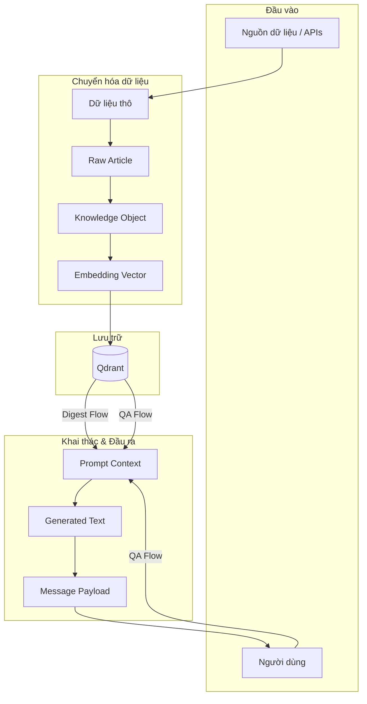

# Data Flow

## Mục đích

Tài liệu này mô tả luồng dữ liệu (Data Flow) của hệ thống AI-Radar ở mức kiến trúc. Khác với Sequence Diagram tập trung vào trình tự gọi giữa các thành phần, Data Flow tập trung vào **sự chuyển hóa của các thực thể dữ liệu** khi chúng đi qua các tầng: từ lúc được thu thập thô sơ cho đến khi trở thành tri thức được lưu trữ, và cuối cùng là được khai thác để phục vụ người dùng.

Mọi luồng dữ liệu trong AI-Radar đều được thiết kế để đảm bảo nguyên tắc *Knowledge-Centric*: Knowledge Object là đơn vị tiền tệ duy nhất và là Single Source of Truth.

## Tổng quan luồng dữ liệu

Sơ đồ dưới đây minh họa hành trình của dữ liệu từ khi bắt đầu xâm nhập vào hệ thống cho đến khi tạo ra giá trị cho người dùng cuối. Hệ thống được chia thành hai nhánh rõ rệt: nhánh **Xây dựng tri thức** (Update) và nhánh **Khai thác tri thức** (Consumption).

## Các thực thể dữ liệu kiến trúc

Trước khi đi vào chi tiết từng luồng, cần thống nhất các thực thể dữ liệu chính di chuyển trong hệ thống (chi tiết thuộc tính đã được định nghĩa trong SDD):

1. **Raw Data:** Dữ liệu gốc từ Internet (HTML, JSON, RSS XML). Không có cấu trúc chuẩn hóa.
2. **Raw Article:** Đối tượng dữ liệu có cấu trúc cơ bản (title, url, content, source) sau khi được Fetcher parse từ Raw Data. Chỉ tồn tại tạm thời trong bộ nhớ.
3. **Knowledge Object:** Thực thể trung tâm. Dữ liệu đã được làm sạch, tóm tắt, phân loại và chuẩn hóa. Đây là dữ liệu duy nhất được lưu trữ lâu dài.
4. **Embedding Vector:** Biểu diễn số học của Knowledge Object, dùng cho Semantic Search.
5. **Prompt Context:** Khối văn bản có cấu trúc, được lắp ráp từ Knowledge Object và câu hỏi/yêu cầu, dùng để gửi cho LLM.
6. **Generated Text:** Văn bản do LLM sinh ra (Summary, Daily Digest, Answer).
7. **Message Payload:** Định dạng tin nhắn cuối cùng, đã được điều chỉnh để tương thích với kênh phân phối (Zalo OA).

## Luồng chuyển hóa dữ liệu chi tiết

### 1. Luồng cập nhật tri thức (Knowledge Update Flow)

Luồng này chịu trách nhiệm biến dữ liệu hỗn độn từ Internet thành tri thức có cấu trúc. Dữ liệu di chuyển theo hướng một chiều (Unidirectional) và không thể đảo ngược.

**Hành trình dữ liệu:**
1. **Raw Data $\rightarrow$ Raw Article:** 
   - Tầng `fetchers/` nhận Raw Data từ RSS/API.
   - Parse và trích xuất các trường thông tin cần thiết, đóng gói thành `Raw Article`.
   - *Lưu ý:* Raw Article không được lưu xuống disk hay database, chỉ tồn tại trong RAM để chuyển sang bước tiếp theo.
2. **Raw Article $\rightarrow$ Knowledge Object:**
   - Tầng `knowledge/` nhận `Raw Article`.
   - Thực hiện Cleaning, Normalization.
   - Gọi LLM để sinh Summary, Key Takeaways, Topics, Keywords.
   - Đóng gói thành `Knowledge Object`.
   - *Lưu ý:* Sau bước này, `Raw Article` bị hủy bỏ (garbage collected). Hệ thống không bao giờ làm việc lại với Raw Article.
3. **Knowledge Object $\rightarrow$ Embedding Vector $\rightarrow$ Qdrant:**
   - Tầng `vectorstores/` nhận `Knowledge Object`.
   - Sinh ra `Embedding Vector`.
   - Đóng gói Vector cùng Metadata (title, summary, topics, url...) thành Payload và Upsert vào Qdrant.

### 2. Luồng tổng hợp bản tin (Daily Digest Flow)

Luồng này khai thác Knowledge Base để tạo ra bản tin hàng ngày. Dữ liệu được đọc từ Qdrant và chuyển hóa thành văn bản tổng hợp.

**Hành trình dữ liệu:**
1. **Qdrant $\rightarrow$ Knowledge Objects:**
   - Tầng `vectorstores/` (Retriever) thực hiện Metadata Filtering (lọc theo ngày, importance score) để lấy ra danh sách `Knowledge Object` nổi bật trong ngày.
2. **Knowledge Objects $\rightarrow$ Prompt Context:**
   - Tầng `services/` (DigestService) nhận danh sách `Knowledge Object`.
   - Gom nhóm theo Topics, sắp xếp thứ tự.
   - Trích xuất `summary` và `key_takeaways` từ các Object, lắp ráp thành `Prompt Context` có cấu trúc.
3. **Prompt Context $\rightarrow$ Generated Text:**
   - `Prompt Context` được gửi đến LLM (qua `integrations/`).
   - LLM sinh ra `Generated Text` (nội dung Daily Digest hoàn chỉnh).
4. **Generated Text $\rightarrow$ Message Payload:**
   - Tầng `integrations/` (Zalo) nhận `Generated Text`.
   - Định dạng lại thành `Message Payload` (chuẩn Markdown/Text của Zalo).
   - Gửi tới người dùng.

### 3. Luồng truy vấn tri thức (Question Answering Flow)

Luồng này xử lý câu hỏi tương tác từ người dùng, sử dụng RAG để sinh câu trả lời dựa trên tri thức đã có.

**Hành trình dữ liệu:**
1. **User Question $\rightarrow$ Query Vector:**
   - Nhận `Question Text` từ Webhook.
   - Tầng `vectorstores/` chuyển `Question Text` thành `Query Vector` (Embedding).
2. **Query Vector + Qdrant $\rightarrow$ Knowledge Objects:**
   - Thực hiện Semantic Search trên Qdrant bằng `Query Vector`.
   - Trả về Top-K `Knowledge Object` có độ tương đồng cao nhất.
3. **Knowledge Objects + Question $\rightarrow$ Prompt Context:**
   - Tầng `services/` (RAGService) kết hợp `Question Text` và danh sách `Knowledge Object` (phần summary/takeaways) để xây dựng `Prompt Context`.
4. **Prompt Context $\rightarrow$ Generated Text:**
   - Gửi `Prompt Context` đến LLM.
   - LLM sinh ra `Generated Text` (Câu trả lời cho người dùng).
5. **Generated Text $\rightarrow$ Message Payload:**
   - Định dạng lại và gửi phản hồi qua Zalo.

## Nguyên tắc chi phối luồng dữ liệu

Để đảm bảo tính nhất quán và hiệu quả, luồng dữ liệu của AI-Radar tuân thủ các nguyên tắc kiến trúc sau:

1. **Knowledge Object là điểm hội tụ (Convergence Point):**
   - Mọi luồng khai thác (Digest, QA) đều chỉ tiêu thụ `Knowledge Object`. 
   - Không có luồng nào đi tắt từ `Raw Article` ra `Generated Text`. Điều này đảm bảo chất lượng đầu ra luôn dựa trên tri thức đã được chuẩn hóa.

2. **Chuyển hóa một chiều (Unidirectional Transformation):**
   - Dữ liệu chỉ tiến hóa từ thô (Raw) $\rightarrow$ chuẩn hóa (Knowledge) $\rightarrow$ khai thác (Consumption).
   - Không có quy trình reverse-engineering từ Knowledge Object ngược lại thành Raw Article.

3. **Tính phù du của dữ liệu trung gian (Ephemeral Intermediate Data):**
   - `Raw Article` chỉ tồn tại trong vòng đời của Knowledge Update Pipeline.
   - `Prompt Context` chỉ tồn tại trong RAM trong thời gian chờ LLM phản hồi.
   - Chỉ có `Knowledge Object` (trong Qdrant) và `Generated Text` (trong Message) là có ý nghĩa lưu trữ hoặc truyền tải.

4. **Tách biệt dữ liệu nghiệp vụ và dữ liệu trình bày:**
   - `Knowledge Object` chứa dữ liệu nghiệp vụ thuần túy (summary, topics).
   - `Message Payload` chứa dữ liệu trình bày (formatting, markdown, Zalo specific tags).
   - Việc chuyển đổi từ `Generated Text` sang `Message Payload` diễn ra hoàn toàn ở tầng Integration, giúp Business Logic không bị ô nhiễm bởi các quy tắc định dạng của kênh phân phối.

## Kết luận

Luồng dữ liệu của AI-Radar được thiết kế xoay quanh trục Knowledge Object. Việc chuẩn hóa dữ liệu sớm (từ Raw Article sang Knowledge Object) và tái sử dụng Knowledge Object cho mọi luồng khai thác giúp hệ thống đạt được sự nhất quán về thông tin, tối ưu chi phí gọi LLM và giảm thiểu độ trễ khi truy vấn. Kiến trúc luồng dữ liệu này là hiện thực hóa trực tiếp của nguyên tắc *Knowledge First* và *Knowledge Reuse*.