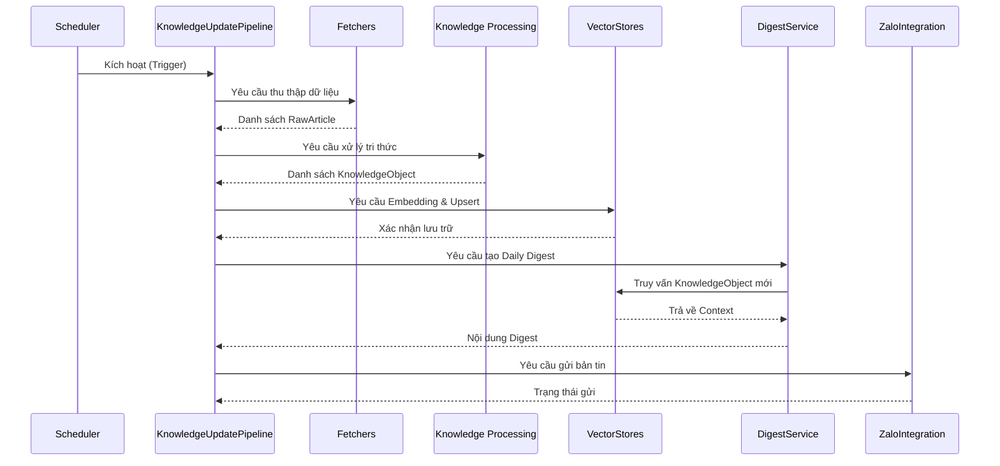

# Knowledge Update Pipeline

## Mục đích

Tài liệu này mô tả chi tiết hành vi runtime của **Knowledge Update Pipeline** (Pipeline A) trong hệ thống AI-Radar. 

Khác với các tài liệu ở Structure View tập trung vào cấu trúc tĩnh, tài liệu này đi sâu vào luồng thực thi động (Dynamic Execution Flow), cách các thành phần phối hợp với nhau theo trình tự thời gian, và chiến lược xử lý lỗi trong quá trình hệ thống tự động thu thập, xử lý và lưu trữ tri thức.

## Tổng quan Pipeline

Knowledge Update Pipeline là luồng xử lý nền tảng, chịu trách nhiệm biến dữ liệu thô từ Internet thành tri thức có cấu trúc (Knowledge Object) và lưu trữ vào Knowledge Base.

**Đặc điểm nhận dạng:**
- **Cơ chế kích hoạt:** Chạy theo lịch (Scheduled), không có tương tác từ người dùng cuối.
- **Mục tiêu:** Cập nhật Knowledge Base và tạo Daily Digest.
- **Tính chất:** Bất đồng bộ (Asynchronous), chạy nền (Background), ưu tiên tính ổn định và toàn vẹn dữ liệu hơn là tốc độ phản hồi tức thời.
- **Nguyên tắc cốt lõi:** Tuân thủ tuyệt đối nguyên tắc *Knowledge First* và *Pipeline-based Processing*.

## Sơ đồ Sequence (Sequence Diagram)

Sơ đồ dưới đây minh họa trình tự gọi và phản hồi giữa các thành phần (Components) trong quá trình Pipeline thực thi.

## Chi tiết các bước thực thi

Luồng xử lý được điều phối bởi `pipelines/knowledge_update.py` và được chia thành 6 giai đoạn chính:

### 1. Kích hoạt (Triggering)
- **Thành phần:** `core/scheduler.py` $\rightarrow$ `pipelines/knowledge_update.py`.
- **Hành động:** Scheduler gửi tín hiệu thực thi (Execution Trigger) vào đúng thời điểm cấu hình (ví dụ: 06:00 sáng).
- **Trạng thái:** Pipeline khởi tạo, tải cấu hình từ `config/` và bắt đầu vòng đời.

### 2. Thu thập dữ liệu (Acquisition)
- **Thành phần:** `fetchers/` (RSS, GitHub, HuggingFace, HackerNews...).
- **Hành động:** Pipeline gọi đồng thời (async) các Fetcher đã đăng ký. Mỗi Fetcher kết nối tới nguồn tương ứng, parse dữ liệu và trả về danh sách `RawArticle`.
- **Đầu ra:** `List<RawArticle>` (chứa title, url, content, source, published_at...).
- **Lưu ý:** Fetcher không thực hiện bất kỳ xử lý ngữ nghĩa hay AI nào.

### 3. Xử lý tri thức (Knowledge Processing)
- **Thành phần:** `knowledge/` (cleaner, summarize, topic_classifier, keyword_extractor).
- **Hành động:** Pipeline duyệt qua từng `RawArticle` và đưa vào động cơ xử lý:
  1. Làm sạch và chuẩn hóa văn bản.
  2. Gọi LLM (thông qua `integrations/groq/`) để tóm tắt, trích xuất từ khóa và phân loại chủ đề.
  3. Lắp ráp dữ liệu thành `KnowledgeObject`.
- **Đầu ra:** `List<KnowledgeObject>` (chứa summary, keywords, topics, importance_score...).
- **Lưu ý:** Đây là bước duy nhất trong Pipeline sử dụng LLM để biến dữ liệu thô thành tri thức.

### 4. Lưu trữ ngữ nghĩa (Semantic Storage)
- **Thành phần:** `vectorstores/` (Qdrant Client, Embedding).
- **Hành động:** Pipeline gửi `KnowledgeObject` xuống tầng Storage. Tầng này sẽ tạo Embedding Vector và thực hiện Upsert vào Qdrant Collection.
- **Đầu ra:** Trạng thái lưu trữ thành công vào Knowledge Base.
- **Lưu ý:** Qdrant chỉ nhận `KnowledgeObject` và Vector, tuyệt đối không lưu `RawArticle`.

### 5. Tổng hợp bản tin (Digest Generation)
- **Thành phần:** `services/digest_service.py`.
- **Hành động:** Sau khi Knowledge Base được cập nhật, Pipeline gọi `DigestService`. Service này sẽ truy vấn `vectorstores/` để lấy các `KnowledgeObject` mới nhất / quan trọng nhất trong ngày, xây dựng Prompt Context và gọi LLM để sinh ra nội dung Daily Digest.
- **Đầu ra:** Nội dung bản tin (Text/Markdown) đã được tổng hợp.

### 6. Phân phối (Notification)
- **Thành phần:** `integrations/zalo/`.
- **Hành động:** Pipeline chuyển nội dung Digest sang tầng Integration. Tầng này định dạng lại tin nhắn theo chuẩn của Zalo OA và gửi đi qua API.
- **Đầu ra:** Trạng thái gửi tin nhắn (Thành công / Thất bại).

## Chiến lược xử lý lỗi (Error Handling Strategy)

Knowledge Update Pipeline tuân thủ nguyên tắc **Fail Gracefully** (Suy giảm dần đều) đã định nghĩa trong SDD. Hệ thống được thiết kế để cô lập lỗi và không để một điểm lỗi cục bộ làm sập toàn bộ Pipeline.

| Giai đoạn | Tình huống lỗi | Chiến lược xử lý |
|---|---|---|
| **Trigger** | Scheduler lỗi cấu hình | Ghi log Critical, hủy Job, không khởi động Pipeline. |
| **Acquisition** | Một Fetcher (ví dụ: GitHub) bị Timeout | Ghi log Warning, bỏ qua nguồn đó, tiếp tục thu thập từ các nguồn khác. Pipeline không dừng. |
| **Processing** | LLM trả về lỗi hoặc dữ liệu không đủ chuẩn | Bỏ qua `RawArticle` đó, ghi log Error, tiếp tục xử lý `RawArticle` tiếp theo. |
| **Storage** | Qdrant không khả dụng (Connection Refused) | Ghi log Critical, **Dừng toàn bộ Pipeline**. Không mất dữ liệu vì `RawArticle` chưa bị xóa, chờ lần chạy sau. |
| **Digestion** | Không có bài viết mới nào được thêm | Bỏ qua bước tạo Digest, ghi log Info. |
| **Notification** | Zalo API trả về lỗi (Rate limit, Token hết hạn) | Ghi log Error, hủy bước gửi tin. **Tri thức vẫn an toàn trong Qdrant**. |

## Đặc điểm kiến trúc nổi bật

1. **Asynchronous by Default:** Bước Acquisition và Processing được thiết kế để chạy bất đồng bộ, giúp giảm tổng thời gian thực thi khi phải gọi nhiều API bên ngoài và LLM.
2. **Knowledge Reuse:** `KnowledgeObject` được tạo ra ở Bước 3 được tái sử dụng ngay lập tức ở Bước 4 (cho Semantic Search sau này) và Bước 5 (cho Daily Digest). Không có việc gọi LLM lại để tóm tắt cho Digest.
3. **Strict Separation:** Pipeline (`pipelines/`) chỉ điều phối. Logic thu thập nằm ở `fetchers/`, logic AI nằm ở `knowledge/`, logic lưu trữ nằm ở `vectorstores/`. Pipeline không chứa "God Logic".
4. **Stateless Execution:** Pipeline không lưu trữ trạng thái chạy dở dang trong bộ nhớ RAM. Nếu bị ngắt quãng, nó sẽ chạy lại từ đầu ở lịch trình tiếp theo. Dữ liệu duy nhất có trạng thái bền vững là Knowledge Base (Qdrant).

## Kết luận

Knowledge Update Pipeline là "trái tim" bơm tri thức vào hệ thống AI-Radar. Việc thiết kế pipeline này theo hướng bất đồng bộ, xử lý lỗi mềm dẻo và tách biệt rõ ràng các tầng trách nhiệm đảm bảo rằng hệ thống luôn duy trì được một Knowledge Base chất lượng cao, phục vụ cho cả chức năng Daily Intelligence và Semantic Question Answering.