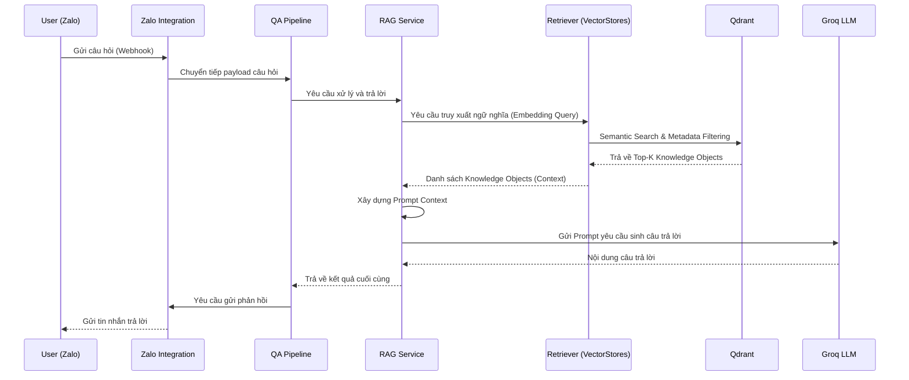

# Question Answering Pipeline

## Mục đích

Tài liệu này mô tả chi tiết hành vi runtime của **Question Answering Pipeline** (Pipeline B) trong hệ thống AI-Radar. 

Khác với Knowledge Update Pipeline (chạy nền theo lịch) và Daily Digest Pipeline (tổng hợp bản tin), Question Answering Pipeline là luồng xử lý tương tác (Interactive), chạy ngay lập tức khi người dùng gửi câu hỏi qua Zalo. Mục tiêu là truy xuất tri thức từ Knowledge Base và sinh câu trả lời chính xác với độ trễ thấp nhất.

## Tổng quan Pipeline

Question Answering Pipeline hiện thực hóa chức năng "Semantic Question Answering" (RAG). Pipeline này khai thác trực tiếp Knowledge Base đã được xây dựng sẵn mà không thực hiện bất kỳ tác vụ thu thập hay xử lý dữ liệu thô nào.

**Đặc điểm nhận dạng:**
- **Cơ chế kích hoạt:** Interactive (Kích hoạt bởi Webhook từ Zalo OA khi người dùng gửi tin nhắn).
- **Mục tiêu:** Trả lời câu hỏi của người dùng dựa trên tri thức đã thu thập.
- **Tính chất:** Read-only đối với Knowledge Base, yêu cầu độ trễ thấp (Low Latency), không trạng thái (Stateless).
- **Nguyên tắc cốt lõi:** Tuân thủ tuyệt đối nguyên tắc *Knowledge Reuse* (không tạo Knowledge Object mới), *Pipeline-based Processing* (tách biệt hoàn toàn với Pipeline A), và *Simplicity First* (sử dụng Naive RAG / Dense Retrieval).

## Sơ đồ Sequence (Sequence Diagram)

Sơ đồ dưới đây minh họa trình tự tương tác giữa các thành phần từ lúc người dùng gửi câu hỏi đến khi nhận được câu trả lời.

## Chi tiết các bước thực thi

Luồng xử lý được điều phối bởi `pipelines/question_answering.py` và `services/rag_service.py`, được chia thành 5 giai đoạn chính:

### 1. Tiếp nhận yêu cầu (Reception)
- **Thành phần:** `integrations/zalo/webhook.py` $\rightarrow$ `pipelines/question_answering.py`.
- **Hành động:** 
  - Webhook endpoint nhận HTTP POST request từ Zalo OA.
  - Xác thực Webhook (nếu có cấu hình Secret).
  - Trích xuất nội dung câu hỏi (User Question) và thông tin người dùng (User ID) từ payload.
  - Chuyển giao cho `QA Pipeline`.
- **Đầu ra:** `User Question` (chuỗi văn bản thuần).

### 2. Truy xuất ngữ nghĩa (Semantic Retrieval)
- **Thành phần:** `services/rag_service.py` $\rightarrow$ `vectorstores/retriever.py` $\rightarrow$ Qdrant.
- **Hành động:**
  - `RAG Service` chuyển `User Question` cho `Retriever`.
  - `Retriever` sử dụng Embedding Model để chuyển câu hỏi thành Vector.
  - Thực hiện **Dense Retrieval** (Semantic Search) trên Qdrant để tìm các `KnowledgeObject` có độ tương đồng cao nhất.
  - Áp dụng **Metadata Filtering** (nếu cần, ví dụ: lọc theo `topics` hoặc `published_at` gần đây).
  - Lấy Top-K `KnowledgeObject` (thường là 3-5 objects).
- **Đầu ra:** `List<KnowledgeObject>` (chứa `summary`, `key_takeaways`, `title`, `url`).
- **Lưu ý:** Tuyệt đối không truy cập Raw Article. Chỉ làm việc với Knowledge Object.

### 3. Xây dựng ngữ cảnh (Context Construction)
- **Thành phần:** `services/rag_service.py`.
- **Hành động:**
  - `RAG Service` nhận danh sách `KnowledgeObject` từ Retriever.
  - Lắp ráp thông tin từ các trường `summary` và `key_takeaways` thành một khối văn bản có cấu trúc (Prompt Context).
  - Kết hợp Prompt Context với `User Question` và `Question Answer Prompt Template` (lấy từ `config/prompts.py`) để tạo thành Prompt hoàn chỉnh.
- **Đầu ra:** Final Prompt (sẵn sàng gửi cho LLM).

### 4. Sinh câu trả lời (Answer Generation)
- **Thành phần:** `services/rag_service.py` $\rightarrow$ `integrations/groq/client.py`.
- **Hành động:**
  - `RAG Service` gửi Final Prompt tới Groq LLM thông qua `Groq Client`.
  - LLM đọc Context và sinh ra câu trả lời bằng ngôn ngữ tự nhiên, bám sát vào tri thức được cung cấp.
  - Nếu LLM không tìm thấy câu trả lời trong Context, nó được chỉ thị (qua Prompt) để trả lời rằng "Không có thông tin trong hệ thống" thay vì tự bịa đặt (giảm thiểu Hallucination).
- **Đầu ra:** `Generated Answer` (chuỗi văn bản).

### 5. Định dạng và Phản hồi (Formatting & Response)
- **Thành phần:** `integrations/zalo/client.py`.
- **Hành động:**
  - `Zalo Integration` nhận `Generated Answer`.
  - Định dạng lại câu trả lời (thêm các liên kết tham khảo `url` từ `KnowledgeObject`, format Markdown sang text thuần hoặc Zalo's rich text nếu cần).
  - Gửi tin nhắn phản hồi lại cho `User ID` tương ứng qua Zalo OA API.
- **Đầu ra:** Tin nhắn đã được gửi thành công tới người dùng.

## Chiến lược xử lý lỗi (Error Handling Strategy)

Question Answering Pipeline yêu cầu độ ổn định cao để đảm bảo trải nghiệm người dùng. Hệ thống áp dụng nguyên tắc **Fail Gracefully** và **No Hallucination**.

| Giai đoạn | Tình huống lỗi | Chiến lược xử lý |
|---|---|---|
| **Reception** | Payload Zalo không hợp lệ / Lỗi xác thực | Trả về HTTP 400/401 cho Zalo, ghi log Warning. Không xử lý tiếp. |
| **Retrieval** | Không tìm thấy Knowledge Object nào liên quan (Score < Threshold) | `RAG Service` dừng luồng, trả về một câu trả lời mặc định: *"Hiện tại AI-Radar chưa có thông tin về vấn đề này."* (Không gọi LLM để tránh hallucination). |
| **Context Building** | Context vượt quá giới hạn Token của LLM | Cắt bớt số lượng Knowledge Object (giảm Top-K) hoặc tóm tắt lại Context. |
| **Generation** | Groq API Timeout / Error | Retry 1 lần. Nếu vẫn lỗi, trả về thông báo lỗi hệ thống cho người dùng: *"Hệ thống đang bận, vui lòng thử lại sau."* |
| **Response** | Zalo API từ chối gửi tin (Rate limit, User block OA) | Ghi log Error. Câu trả lời đã sinh ra bị hủy bỏ. |

## Đặc điểm kiến trúc nổi bật

1. **Strictly Read-Only & No Real-time Processing:** 
   - Pipeline B **tuyệt đối không** thực hiện Crawl, Clean, Summarize hay Embedding. 
   - Mọi dữ liệu đầu vào cho LLM đều đến từ Qdrant. Điều này đảm bảo độ trễ của Pipeline chỉ phụ thuộc vào tốc độ Vector Search và LLM Generation, không bị nghẽn ở khâu xử lý dữ liệu thô.
2. **Stateless Interaction:** 
   - Hệ thống không lưu trữ lịch sử hội thoại (Session/Chat History) của người dùng trong bộ nhớ hoặc Database. 
   - Mỗi câu hỏi được xử lý độc lập dựa trên toàn bộ Knowledge Base. Điều này giúp hệ thống đơn giản hơn và không tốn dung lượng lưu trữ cho chat history.
3. **Prompt Engineering over Complex RAG:** 
   - AI-Radar sử dụng chiến lược Naive RAG (Dense Retrieval + Top-K + Metadata Filtering). 
   - Chất lượng câu trả lời phụ thuộc chủ yếu vào chất lượng của `Knowledge Object` (đã được chuẩn hóa ở Pipeline A) và kỹ thuật `Prompt Engineering` (trong `config/prompts.py`), thay vì sử dụng các kỹ thuật RAG phức tạp như GraphRAG hay Agentic RAG.
4. **Decoupled LLM Generation:** 
   - Logic xây dựng Context (`RAG Service`) tách biệt hoàn toàn với logic gọi LLM (`Groq Client`). 
   - Giúp dễ dàng thay đổi Prompt Template hoặc chuyển đổi sang LLM Provider khác (như OpenRouter) mà không ảnh hưởng đến luồng Retrieval.

## Kết luận

Question Answering Pipeline là giao diện trí tuệ trực tiếp của AI-Radar với người dùng cuối. Bằng việc tận dụng tối đa Knowledge Base đã được xây dựng kỹ lưỡng từ Knowledge Update Pipeline, luồng xử lý này cung cấp khả năng trả lời câu hỏi nhanh chóng, chính xác và đáng tin cậy, hoàn thiện vòng khép kín của một hệ thống Knowledge Intelligence.