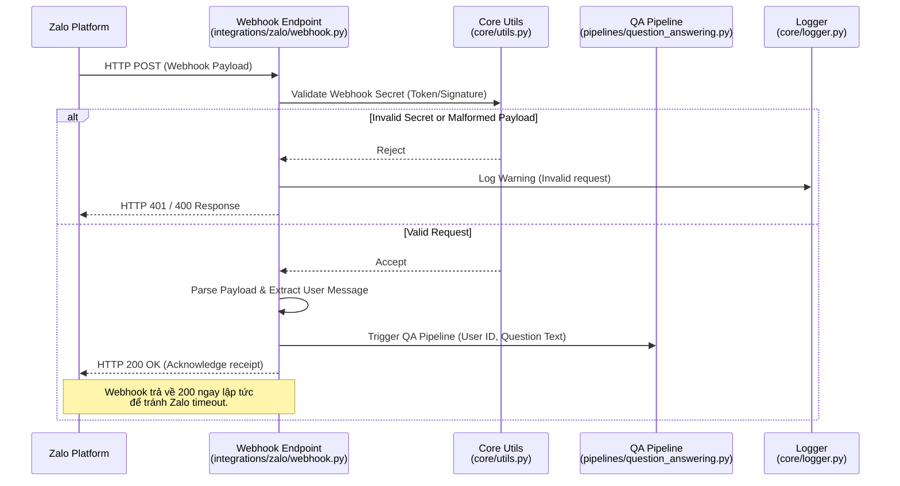
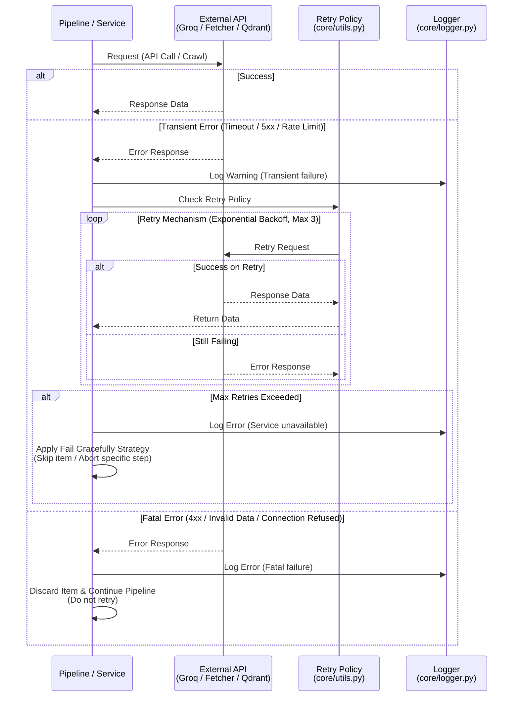
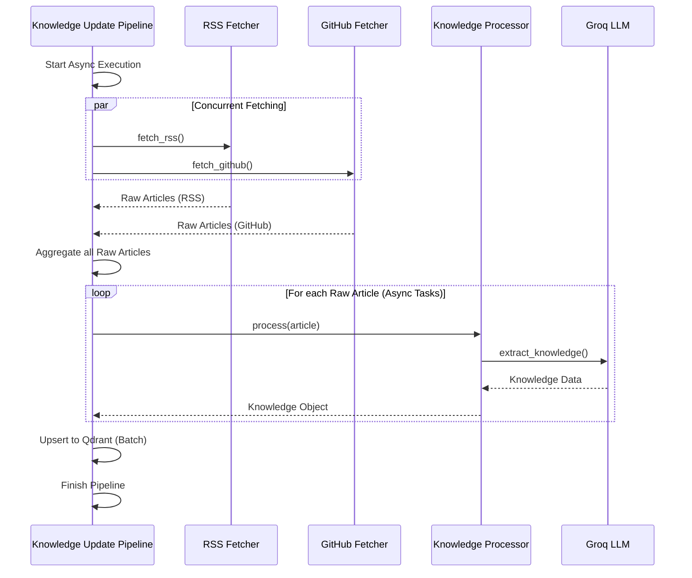

# Sequence Diagrams

## Mục đích

Tài liệu này tập hợp và mở rộng các Sequence Diagram cho các luồng tương tác nền tảng và cơ chế xử lý sự cố của AI-Radar. 

Trong khi các tài liệu trước trong Runtime View tập trung vào luồng nghiệp vụ (Pipeline Flow), tài liệu này đi sâu vào cách các thành phần hạ tầng (`integrations/`, `core/`) phối hợp để giải quyết các tình huống thực tế khi hệ thống vận hành: tiếp nhận request từ bên ngoài (Webhook) và đối mặt với các lỗi mạng/dịch vụ (Retry & Error Handling).

Mọi tương tác trong các sơ đồ dưới đây đều tuân thủ tuyệt đối các nguyên tắc *Loose Coupling*, *Replaceable Infrastructure* và *Fail Gracefully* đã định nghĩa.

## 1. Luồng tiếp nhận và xử lý Webhook (Webhook Reception Flow)

Sơ đồ này mô tả chi tiết cách hệ thống tiếp nhận câu hỏi từ người dùng qua Zalo. Nó làm rõ ranh giới bảo mật và trách nhiệm giữa tầng Integration (`integrations/zalo/webhook.py`) và tầng điều phối (`pipelines/`).

**Đặc điểm kiến trúc:**
- Webhook endpoint chỉ đóng vai trò là "người gác cổng" (Gatekeeper).
- Mọi xác thực (Authentication) và phân tích cú pháp (Parsing) đều diễn ra ở tầng Integration.
- Pipeline nghiệp vụ (`QA Pipeline`) hoàn toàn không biết về giao thức HTTP hay định dạng raw payload của Zalo.

**Lưu ý quan trọng:** Hệ thống trả về `HTTP 200 OK` cho Zalo ngay sau khi nhận và phân tích xong payload, *trước khi* QA Pipeline kịp xử lý và sinh câu trả lời. Điều này đảm bảo Webhook không bị timeout (do quá trình gọi LLM có thể mất vài giây). Việc gửi tin nhắn trả lời sẽ được thực hiện bất đồng bộ thông qua `Zalo Client` (Send API) ở cuối QA Pipeline.

## 2. Cơ chế xử lý lỗi và Retry (Error Handling & Retry Strategy)

AI-Radar phụ thuộc vào nhiều dịch vụ bên ngoài (Groq API, RSS Sources, GitHub API, Qdrant). Các dịch vụ này có thể gặp lỗi tạm thời (Transient Errors) như Timeout, Rate Limit, hoặc 5xx. 

Sơ đồ dưới đây minh họa cách `core/` và các `services/` / `fetchers/` phối hợp để hiện thực hóa nguyên tắc **Fail Gracefully** và **Asynchronous by Default**.

**Đặc điểm kiến trúc:**
- Phân biệt rõ ràng giữa *Transient Error* (có thể Retry) và *Fatal Error* (dữ liệu sai, 4xx, cần bỏ qua).
- Việc Retry được thực hiện ở tầng gọi API, không làm阻塞 (block) toàn bộ Pipeline nếu có thể xử lý song song.
- Mọi lỗi đều được ghi nhận vào `Logger` để phục vụ Observability.

**Áp dụng vào thực tế:**
- **Với Fetchers:** Nếu một nguồn RSS bị Timeout (Transient), hệ thống sẽ Retry. Nếu vẫn lỗi, nó ghi log và bỏ qua nguồn đó, tiếp tục thu thập từ các nguồn khác (Pipeline không dừng).
- **Với Groq API (Knowledge Extraction):** Nếu LLM trả về 5xx, hệ thống Retry. Nếu hết số lần Retry, `Raw Article` đó bị loại bỏ, không tạo ra `Knowledge Object`, các bài khác vẫn tiếp tục xử lý.
- **Với Qdrant:** Nếu Qdrant Connection Refused (Fatal/Infrastructure down), hệ thống ghi log Critical và **Dừng toàn bộ Pipeline Update** để tránh mất dữ liệu hoặc trạng thái不一致 (inconsistent state).

## 3. Tổng quan điều phối bất đồng bộ (Asynchronous Orchestration Overview)

Để tối ưu hóa thời gian thực thi của Knowledge Update Pipeline (khi phải gọi nhiều Fetcher và LLM), hệ thống sử dụng `asyncio`. Sơ đồ này minh họa cách Pipeline điều phối các tác vụ I/O bất đồng bộ.

**Đặc điểm kiến trúc:**
- Giai đoạn **Acquisition** chạy hoàn toàn song song (`par Concurrent Fetching`).
- Giai đoạn **Processing** sử dụng `asyncio.gather` hoặc Task Queue để gọi LLM cho nhiều bài viết đồng thời, giúp giảm tổng thời gian chạy Pipeline từ vài chục phút xuống còn vài phút.

## Kết luận

Các Sequence Diagram trong tài liệu này làm rõ cách AI-Radar vận hành ở mức độ hạ tầng và xử lý sự cố. Việc tách biệt rõ ràng giữa Webhook Handling, Retry Mechanism và Asynchronous Orchestration giúp hệ thống duy trì được tính ổn định (Reliability), khả năng phản hồi (Responsiveness) và tối ưu hiệu năng (Performance) ngay cả khi các dịch vụ bên ngoài hoạt động không ổn định.