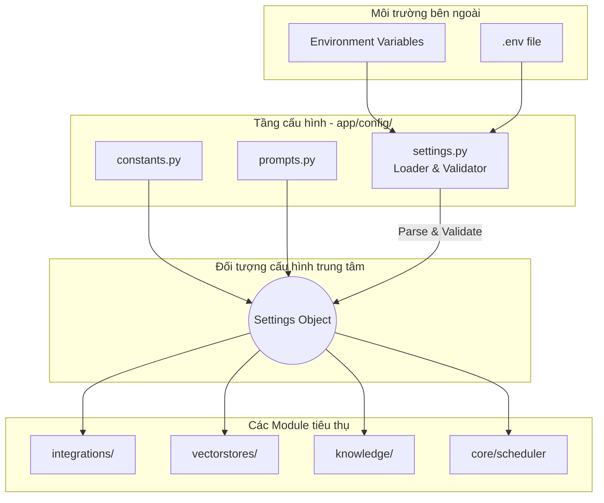

# Configuration Strategy

## Mục đích

Tài liệu này định nghĩa chiến lược quản lý cấu hình (Configuration Strategy) của AI-Radar. 

Mục tiêu là đảm bảo rằng mọi tham số có thể thay đổi, thông tin xác thực và biến môi trường đều được tách biệt hoàn toàn khỏi Business Logic và Source Code. Chiến lược này giúp hệ thống dễ dàng triển khai trên nhiều môi trường (Development, Testing, Production) mà không cần chỉnh sửa mã nguồn, đồng thời tuân thủ tuyệt đối nguyên tắc *Security by Simplicity* và *Replaceable Infrastructure*.

## Nguyên tắc cấu hình (Configuration Principles)

Toàn bộ hệ thống AI-Radar tuân thủ các nguyên tắc cấu hình sau:

1. **Separation of Code and Config:** Mã nguồn chỉ chứa các giá trị mặc định (default values) hoặc các hằng số nghiệp vụ bất biến. Mọi thông tin đặc thù của môi trường (endpoints, API keys) phải được nạp từ bên ngoài.
2. **Environment-Based Injection:** Các biến môi trường (Environment Variables) là nguồn cung cấp cấu hình duy nhất cho các thông tin nhạy cảm và đặc thù môi trường.
3. **Fail-Fast on Startup:** Nếu các cấu hình bắt buộc (Critical Configurations) bị thiếu hoặc không hợp lệ, hệ thống phải từ chối khởi động (crash immediately) thay vì chạy ngầm và thất bại ở runtime.
4. **Single Source of Settings:** Business Logic không đọc trực tiếp từ Environment Variables hay file `.env`. Mọi module đều truy cập cấu hình thông qua một `Settings Object` trung tâm đã được validate.

## Phân loại cấu hình (Configuration Categories)

Để quản lý hiệu quả, cấu hình của AI-Radar được phân thành 4 nhóm rõ rệt, tương ứng với cách thức lưu trữ và nạp vào hệ thống:

### 1. Secrets & Credentials (Thông tin xác thực)
Bao gồm các khóa API, token và secret dùng để giao tiếp với dịch vụ bên ngoài.
- **Ví dụ:** `GROQ_API_KEY`, `ZALO_ACCESS_TOKEN`, `ZALO_REFRESH_TOKEN`, `WEBHOOK_SECRET`.
- **Lưu trữ:** Bắt buộc nằm trong Environment Variables (hoặc file `.env` ở local).
- **Kiến trúc:** Không bao giờ được ghi vào Log, không được hard-code trong source code.

### 2. Infrastructure Endpoints (Điểm cuối hạ tầng)
Bao gồm các URL, port, và thông tin kết nối tới các dịch vụ hạ tầng.
- **Ví dụ:** `QDRANT_HOST`, `QDRANT_PORT`, `QDRANT_API_KEY` (nếu có).
- **Lưu trữ:** Environment Variables.
- **Kiến trúc:** Giúp dễ dàng chuyển đổi giữa môi trường Local (Docker compose) và Cloud mà không cần sửa code.

### 3. Operational & Business Parameters (Tham số vận hành & nghiệp vụ)
Bao gồm các tham số điều chỉnh hành vi của hệ thống, mô hình AI và lịch trình.
- **Ví dụ:** `LLM_MODEL_NAME`, `EMBEDDING_MODEL_NAME`, `RETRIEVAL_TOP_K`, `SCHEDULER_CRON`, `LOG_LEVEL`.
- **Lưu trữ:** Environment Variables (để dễ dàng override) hoặc `settings.py` (cho các giá trị mặc định).
- **Kiến trúc:** Cho phép tinh chỉnh hiệu năng và chi phí (như thay đổi Top-K, đổi LLM model) mà không cần deploy lại code.

### 4. Static Constants & Prompts (Hằng số & Prompt mẫu)
Bao gồm các dữ liệu tĩnh, ít thay đổi, định nghĩa hành vi cốt lõi của AI và nghiệp vụ.
- **Ví dụ:** Danh sách chủ đề (Topics) được phép, các Prompt Template dùng cho LLM.
- **Lưu trữ:** Trực tiếp trong source code (`constants.py`, `prompts.py`).
- **Kiến trúc:** Được version control cùng với mã nguồn vì việc thay đổi chúng đồng nghĩa với việc thay đổi hành vi logic của hệ thống.

## Ánh xạ sang cấu trúc mã nguồn (Source Code Mapping)

Chiến lược cấu hình được hiện thực hóa thông qua thư mục `app/config/` và file `.env` ở thư mục gốc, tuân thủ đúng `FolderStructure.md`.

```text
ai-radar/
├── .env                     # Chứa Secrets & Infrastructure Endpoints (Không commit lên Git)
├── .env.example             # Template mẫu cho .env (Commit lên Git)
└── app/
    └── config/
        ├── settings.py      # Định nghĩa Settings Object, load từ .env & env vars.
        ├── constants.py     # Chứa Static Constants (Topics, Limits).
        └── prompts.py       # Chứa Prompt Templates cho LLM.
```

### Trách nhiệm của từng thành phần:
- **`.env` / `.env.example`:** Lưu trữ các biến môi trường. `.env.example` đóng vai trò là tài liệu hướng dẫn cấu hình cho Developer mới.
- **`settings.py`:** Đóng vai trò là *Configuration Loader*. Nó đọc từ Environment Variables, áp dụng các giá trị mặc định (default values), thực hiện validation (kiểm tra kiểu dữ liệu, kiểm tra sự tồn tại của các trường bắt buộc) và đóng gói thành một `Settings` object.
- **`constants.py`:** Chứa các hằng số nghiệp vụ bất biến (ví dụ: danh sách các chủ đề AI chuẩn hóa như `LLM`, `RAG`, `Computer Vision`).
- **`prompts.py`:** Chứa các chuỗi template (f-string hoặc Jinja2) dùng để xây dựng Prompt cho Groq LLM. Việc tách riêng giúp việc tinh chỉnh Prompt (Prompt Engineering) không làm ảnh hưởng đến logic điều phối.

## Cơ chế nạp và phân phối cấu hình (Loading & Injection Flow)

Sơ đồ dưới đây minh họa cách cấu hình được nạp vào hệ thống khi khởi động và được phân phối đến các module.



**Đặc điểm kiến trúc:**
1. **Khởi động (Startup):** Khi `main.py` được thực thi, `settings.py` sẽ ngay lập tức đọc Environment Variables. Nếu thiếu `GROQ_API_KEY` hoặc `QDRANT_HOST`, hệ thống ném ra Exception và dừng lại.
2. **Trung tâm hóa (Centralization):** `Settings Object` là điểm truy cập duy nhất. Các module như `GroqClient` hay `QdrantClient` sẽ nhận các tham số kết nối từ `Settings Object` (thông qua Dependency Injection hoặc truy cập global singleton) thay vì tự gọi `os.getenv()`.
3. **Tách biệt Logic và Trình bày:** `prompts.py` cung cấp các template thô. Việc lắp ráp dữ liệu vào template là trách nhiệm của `knowledge/` hoặc `services/`.

## Bảo mật và Ranh giới cấu hình (Security & Boundaries)

Để đảm bảo nguyên tắc *Security by Simplicity* (đã định nghĩa trong SDD Chương 11), kiến trúc cấu hình thiết lập các ranh giới sau:

1. **Business Logic không quản lý Secret:** Các module như `digest_service.py` hay `rag_service.py` không biết API Key trông như thế nào. Chúng chỉ gọi `integrations/` và tầng Integration sẽ tự lấy Key từ `Settings` để đính kèm vào HTTP Header.
2. **Logging Safety:** `core/logger.py` được cấu hình để tự động lọc và che giấu (mask) các giá trị được đánh dấu là nhạy cảm trong `Settings Object` trước khi ghi ra console hoặc file log.
3. **No Hardcoding:** Mọi URL của dịch vụ bên ngoài (Zalo API endpoint, Qdrant URL) đều phải đi qua `Settings`. Điều này hỗ trợ tối đa cho nguyên tắc *Replaceable Infrastructure*.

## Kết luận

Chiến lược cấu hình của AI-Radar được thiết kế để tối ưu hóa sự đơn giản và an toàn. Bằng việc sử dụng Environment Variables cho các thông tin động/nhạy cảm và source code cho các hằng số tĩnh, hệ thống duy trì được tính linh hoạt khi triển khai (Portability) trong khi vẫn giữ cho mã nguồn sạch sẽ, dễ kiểm thử và dễ dàng thay thế hạ tầng.