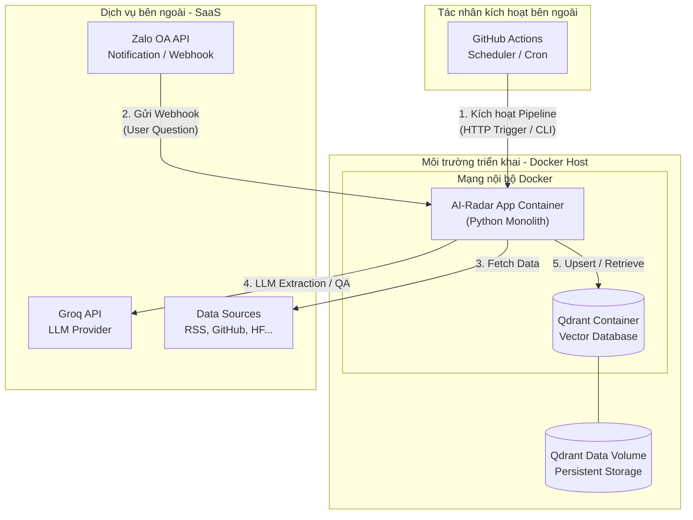

# Deployment View

## Mục đích

Tài liệu này mô tả Góc nhìn triển khai (Deployment View) của hệ thống AI-Radar. 

Mục tiêu là xác định cách các thành phần của hệ thống được đóng gói, cấu hình và vận hành trong môi trường thực tế. Khác với các tài liệu trước tập trung vào logic nghiệp vụ hoặc cấu trúc mã nguồn, Deployment View trả lời câu hỏi: "Hệ thống chạy ở đâu, chạy như thế nào và các thành phần hạ tầng kết nối với nhau ra sao?".

Toàn bộ chiến lược triển khai được thiết kế dựa trên nguyên tắc *Simplicity First* và *Avoid Over-Engineering*, phù hợp với quy mô của một Knowledge Intelligence System cá nhân.

## Nguyên tắc triển khai

1. **Containerization First:** Toàn bộ ứng dụng và cơ sở dữ liệu cục bộ đều được đóng gói dưới dạng Docker Container. Đảm bảo môi trường chạy nhất quán từ lúc phát triển (Local) đến khi triển khai (Production).
2. **Monolithic Deployment:** AI-Radar là một ứng dụng đơn thể (Monolith). Toàn bộ Business Logic, Webhook Handler và Pipeline Runner đều chạy trong cùng một process/container. Không triển khai dưới dạng Microservices hay Distributed Cluster.
3. **Infrastructure as Code (Cơ bản):** Môi trường triển khai được định nghĩa thông qua `Dockerfile`, `docker-compose.yml` và GitHub Actions workflows. Việc tái tạo môi trường chỉ đòi hỏi một lệnh duy nhất.
4. **Stateless Application, Stateful Storage:** Container của ứng dụng AI-Radar là Stateless (không lưu trữ trạng thái nghiệp vụ trong bộ nhớ). Mọi trạng thái bền vững (Knowledge Base, History) đều được đẩy ra ngoài vào các Volume của Docker hoặc các dịch vụ Cloud (Qdrant, Groq).

## Mô hình triển khai tổng thể (Deployment Topology)

Sơ đồ dưới đây minh họa ranh giới triển khai của AI-Radar và cách các thành phần tương tác với nhau trong môi trường Production.

## Chi tiết các thành phần triển khai

### 1. AI-Radar Application Container
- **Công nghệ:** Python 3.10+, Docker.
- **Vai trò:** Chứa toàn bộ mã nguồn nghiệp vụ (`app/`). 
- **Chế độ chạy:** 
  - Chạy như một Web Server (ví dụ: FastAPI/Uvicorn) để lắng nghe Webhook từ Zalo OA.
  - Đồng thời exposing một CLI endpoint hoặc internal API để GitHub Actions có thể kích hoạt Knowledge Update Pipeline.
- **Cấu hình:** Nhận toàn bộ biến môi trường (API Keys, Endpoints) thông qua file `.env` được inject vào lúc khởi động container.

### 2. Qdrant Container (Vector Database)
- **Công nghệ:** Qdrant (Docker Image chính chủ).
- **Vai trò:** Lưu trữ Knowledge Base (Embedding Vectors + Metadata).
- **Triển khai:** Chạy trong cùng một Docker Network với AI-Radar App để đảm bảo độ trễ thấp và bảo mật (không expose port Qdrant ra internet public, chỉ expose trong internal network).
- **Lưu trữ:** Sử dụng Docker Volume (`qdrant_data`) để gắn (mount) vào thư mục dữ liệu của Qdrant, đảm bảo dữ liệu không bị mất khi container bị restart.

### 3. GitHub Actions (Scheduler & CI/CD)
- **Vai trò:** Đóng vai trò là Scheduler bên ngoài và hệ thống CI/CD cơ bản.
- **Hoạt động:**
  - **CI/CD:** Tự động chạy test, build Docker image khi có Pull Request.
  - **Scheduler:** Sử dụng `cron` schedule của GitHub Actions để định kỳ (ví dụ: 06:00 sáng) gọi vào AI-Radar App, kích hoạt Knowledge Update Pipeline.

### 4. Các dịch vụ bên ngoài (External SaaS)
- **Groq API, Zalo OA API, Data Sources (RSS, GitHub...):** Không được triển khai bởi AI-Radar. Hệ thống chỉ kết nối tới chúng thông qua HTTPS qua internet.

## Quản lý cấu hình và Dữ liệu (Configuration & Data Management)

### Biến môi trường (Environment Variables)
Mọi thông tin nhạy cảm và đặc thù môi trường đều được quản lý qua file `.env`. File này **không** được commit lên Git.
- **Local Development:** Sử dụng file `.env` ở thư mục gốc.
- **Production:** Cấu hình trực tiếp trên môi trường triển khai (ví dụ: Environment Variables của VPS, hoặc Docker Secrets).

### Docker Compose
File `docker-compose.yml` là trung tâm của việc triển khai cục bộ và trên VPS. Nó định nghĩa:
- Service `app`: Build từ `Dockerfile`, map port 8000 (cho Zalo Webhook), inject `.env`.
- Service `qdrant`: Pull image `qdrant/qdrant`, map port 6333 (internal), mount volume `qdrant_storage`.
- Network `ai_radar_network`: Kết nối nội bộ giữa `app` và `qdrant`.

## Tự động hóa & Lịch trình (Automation & Scheduling)

AI-Radar không sử dụng các hệ thống Message Queue phức tạp (như Celery, RabbitMQ) để điều phối lịch trình. Thay vào đó, hệ thống tận dụng GitHub Actions:

1. **Trigger:** GitHub Actions chạy theo lịch `cron`.
2. **Execution:** Workflow gọi HTTP Request đến endpoint nội bộ của AI-Radar App (hoặc chạy CLI command `python -m scripts.update_knowledge` trong container).
3. **Isolation:** Nếu Pipeline chạy trong Docker container, GitHub Actions có thể SSH vào host và thực thi `docker exec ai-radar-app python -m app.main --run-update`.

Cách tiếp cận này giữ cho kiến trúc ứng dụng cực kỳ đơn giản, không cần tích hợp thêm các worker hay broker.

## Sao lưu và Phục hồi (Backup & Recovery)

Vì AI-Radar là hệ thống cá nhân và tuân thủ nguyên tắc đơn giản, chiến lược sao lưu tập trung vào tài sản quan trọng nhất: **Knowledge Base**.

1. **Application Code:** Được sao lưu tự động trên GitHub.
2. **Configuration (.env):** Được quản lý thủ công hoặc sử dụng các công cụ Secret Manager của nền tảng triển khai (VPS/Cloud).
3. **Knowledge Base (Qdrant):** 
   - Dữ liệu Qdrant nằm trên Docker Volume.
   - **Chiến lược:** Định kỳ (ví dụ: hàng tuần) thực hiện script dump dữ liệu từ Qdrant ra file snapshot hoặc backup toàn bộ thư mục volume lên Cloud Storage (như GitHub Releases, S3, hoặc Google Drive).
   - **Phục hồi:** Khi cần, chỉ cần khởi tạo container Qdrant mới và restore thư mục volume từ bản backup.

## Những gì nằm ngoài phạm vi (Out of Scope)

Để tránh over-engineering, các thành phần sau **không** nằm trong chiến lược triển khai của phiên bản đầu tiên:
- **Kubernetes (K8s) / Docker Swarm:** Không sử dụng vì quy mô chỉ là một ứng dụng đơn thể.
- **Multi-region / High Availability Cluster:** Không yêu cầu tính sẵn sàng cao (99.99%). Nếu server chết, hệ thống dừng và chờ khởi động lại.
- **Distributed Vector Database (Qdrant Cloud / Milvus Cluster):** Sử dụng Qdrant Standalone Docker container.
- **Complex CI/CD (Blue-Green, Canary Deployment):** Chỉ áp dụng CI/CD cơ bản (Build & Test). Deploy thủ công hoặc qua SSH script đơn giản.

## Kết luận

Deployment View của AI-Radar phản ánh đúng triết lý *Simplicity Wins*. Bằng việc sử dụng Docker Compose để đóng gói ứng dụng và cơ sở dữ liệu, kết hợp với GitHub Actions cho việc điều phối lịch trình, hệ thống đạt được sự cân bằng hoàn hảo giữa tính tự động hóa, khả năng tái tạo môi trường và sự đơn giản trong vận hành. Kiến trúc triển khai này đảm bảo AI-Radar có thể chạy ổn định trên một VPS cơ bản nhất mà không cần đến các hạ tầng phân tán phức tạp.