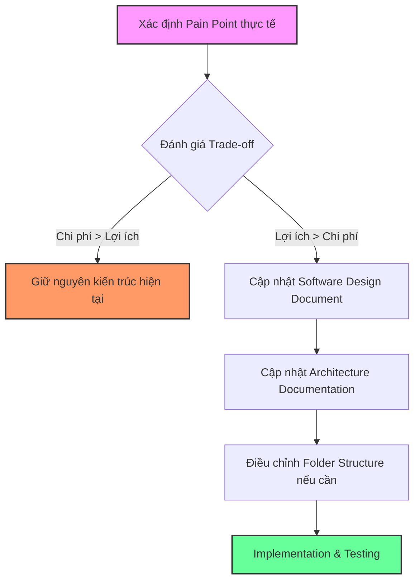

# Future Evolution

## Mục đích

Tài liệu này mô tả lộ trình và triết lý tiến hóa kiến trúc (Architectural Evolution) của AI-Radar trong tương lai. 

Khác với một bản kế hoạch sản phẩm (Product Roadmap) liệt kê các tính năng mong muốn, tài liệu này tập trung vào **cách kiến trúc hiện tại có thể thích ứng và mở rộng** để đáp ứng các nhu cầu mới mà không làm phá vỡ các nguyên tắc cốt lõi (Knowledge-Centric, Simplicity First, Loose Coupling).

Mọi sự tiến hóa đều phải xuất phát từ các "Pain Point" thực tế trong quá trình vận hành, không phải từ sự suy đoán hoặc xu hướng công nghệ.

## Nguyên tắc tiến hóa (Evolution Principles)

Mọi thay đổi kiến trúc trong tương lai của AI-Radar phải tuân thủ nghiêm ngặt các nguyên tắc sau:

1. **Pain Point Driven:** Không tối ưu hóa hoặc mở rộng kiến trúc chỉ vì "cảm giác" hoặc để hệ thống "trông có vẻ hiện đại". Chỉ thay đổi khi có bằng chứng rõ ràng về giới hạn hiệu năng, chi phí hoặc khả năng bảo trì.
2. **Preserve the Core:** Các thay đổi phải bảo vệ tính toàn vẹn của Knowledge Object và Dual Pipeline Architecture. Không được phép thay đổi Single Source of Truth.
3. **Trade-off Over Perfection:** Mọi đề xuất mở rộng (ví dụ: chuyển sang Hybrid Retrieval, thêm Message Queue) đều phải được đánh giá kỹ lưỡng về chi phí, độ phức tạp và lợi ích thực tế trước khi phê duyệt.
4. **Extensibility First:** Ưu tiên giải quyết nhu cầu mới bằng cách mở rộng các module hiện có (thêm Fetcher, thêm Integration) thay vì viết lại kiến trúc nền tảng.

## Lộ trình tiến hóa kiến trúc (Architectural Evolution Path)

Dựa trên các giới hạn đã được chấp nhận trong phiên bản đầu tiên (v1), kiến trúc AI-Radar được thiết kế với các "điểm mở rộng" (Extension Points) rõ ràng cho các kịch bản phát triển sau:

### 1. Mở rộng nguồn dữ liệu và xử lý tri thức (Data & Processing Extensibility)
- **Hiện tại:** Hỗ trợ một số nguồn RSS, GitHub, HuggingFace cơ bản.
- **Tiến hóa:** Bổ sung các nguồn phức tạp hơn (ArXiv, YouTube Transcripts, PDF Research Papers).
- **Tác động kiến trúc:** 
  - Chỉ cần thêm class mới kế thừa `BaseFetcher` trong `app/fetchers/`.
  - Có thể bổ sung các Processor mới vào `app/knowledge/` (ví dụ: `entity_extractor.py`, `trend_detector.py`) mà không ảnh hưởng đến luồng dữ liệu cốt lõi, miễn là đầu ra cuối cùng vẫn là `KnowledgeObject` chuẩn hóa.

### 2. Nâng cấp chiến lược Retrieval (Retrieval Strategy Evolution)
- **Hiện tại:** Naive RAG (Dense Retrieval + Top-K + Metadata Filtering).
- **Tiến hóa:** Nếu chất lượng câu trả lời không đáp ứng được yêu cầu, có thể xem xét nâng cấp lên Hybrid Retrieval (kết hợp Keyword Search và Semantic Search) hoặc Re-ranking.
- **Tác động kiến trúc:** 
  - Logic này sẽ được đóng gói hoàn toàn trong `app/vectorstores/retriever.py` và `app/services/rag_service.py`.
  - Tầng `pipelines/` và `integrations/` sẽ không thay đổi vì interface đầu vào/đầu ra của Retrieval vẫn giữ nguyên (nhận Question, trả về List<KnowledgeObject>).

### 3. Mở rộng kênh tích hợp và LLM (Integration & LLM Extensibility)
- **Hiện tại:** Groq API và Zalo Official Account.
- **Tiến hóa:** Bổ sung các kênh phân phối khác (Telegram, Discord, Email) hoặc thay đổi LLM Provider (OpenRouter, Ollama) để tối ưu chi phí/hiệu năng.
- **Tác động kiến trúc:** 
  - Kiến trúc Adapter Pattern trong `app/integrations/` cho phép bổ sung `telegram/` hoặc `openrouter/` một cách độc lập.
  - Business Logic trong `services/` hoàn toàn không biết về sự thay đổi này, đảm bảo nguyên tắc *Replaceable Infrastructure*.

### 4. Nâng cao khả năng quan sát và vận hành (Observability & Operations)
- **Hiện tại:** Logging cơ bản qua `core/logger.py` và GitHub Actions Scheduler.
- **Tiến hóa:** Khi hệ thống chạy ổn định nhưng khó theo dõi, có thể bổ sung Health Checks, Metrics (ví dụ: thời gian chạy Pipeline, số lượng bài xử lý) và Alerting.
- **Tác động kiến trúc:** 
  - Có thể tách biệt module `monitoring/` hoặc tích hợp các exporter (ví dụ: Prometheus) vào `core/`.
  - Việc này không làm thay đổi luồng xử lý nghiệp vụ chính.

### 5. Tiến hóa hạ tầng (Infrastructure Evolution - Có điều kiện)
- **Hiện tại:** Monolithic Deployment trên một Docker Container duy nhất.
- **Tiến hóa:** Nếu Knowledge Base vượt quá khả năng của một máy chủ, hoặc thời gian xử lý Pipeline trở nên không thể chấp nhận được.
- **Tác động kiến trúc:** 
  - **Bước 1:** Tách biệt Database (chuyển Qdrant sang managed cloud service).
  - **Bước 2 (Chỉ khi thực sự cần):** Đưa các tác vụ nặng (Embedding, LLM Processing) vào Message Queue (Redis/RabbitMQ) và tách thành Worker riêng biệt. 
  - **Lưu ý:** Việc chuyển sang Microservices hoặc Distributed Processing **không** nằm trong kế hoạch mặc định và chỉ được xem xét khi Monolith thực sự đạt giới hạn vật lý.

## Sơ đồ quy trình đánh giá thay đổi (Change Evaluation Process)

Để đảm bảo kiến trúc không bị "phình to" (Feature Creep) hoặc Over-Engineering, mọi đề xuất thay đổi kiến trúc trong tương lai phải đi qua quy trình đánh giá sau:

## Các giới hạn kiến trúc không vượt qua (Architectural Non-Goals)

Để duy trì sự đơn giản và tập trung vào mục tiêu cốt lõi, AI-Radar sẽ **không** tiến hóa theo các hướng sau, trừ khi có sự thay đổi hoàn toàn về mục tiêu dự án:

1. **Không trở thành nền tảng đa người dùng (Multi-user Platform):** Không xây dựng hệ thống Authentication, Authorization, Role Management hoặc User Dashboard phức tạp.
2. **Không trở thành General-purpose Chatbot:** AI-Radar là Knowledge Intelligence System. Nó không được thiết kế để trò chuyện xã giao hoặc thực hiện các tác vụ không liên quan đến kho tri thức AI đã thu thập.
3. **Không áp dụng kiến trúc phân tán không cần thiết:** Không sử dụng Kubernetes, Service Mesh, hoặc Event Streaming (Kafka) nếu một Docker Container và Cron Job vẫn đáp ứng được nhu cầu.
4. **Không theo đuổi các biến thể RAG phức tạp một cách mù quáng:** GraphRAG, Agentic RAG, hoặc Multi-hop Retrieval chỉ được xem xét nếu có bằng chứng thực nghiệm rõ ràng cho thấy Naive RAG thất bại hoàn toàn trong việc giải quyết bài toán cụ thể.

## Kết luận

Kiến trúc của AI-Radar được thiết kế như một "cái khung" vững chắc nhưng linh hoạt. Nó đủ đơn giản để một cá nhân có thể vận hành và bảo trì hiệu quả, nhưng cũng đủ mở (Extensible) để thích ứng với các nguồn dữ liệu mới, công cụ AI mới và kênh phân phối mới trong tương lai. 

Sự tiến hóa của AI-Radar sẽ luôn được dẫn dắt bởi dữ liệu thực tế và các nguyên tắc thiết kế đã được thống nhất, đảm bảo hệ thống luôn giữ được giá trị cốt lõi: một Knowledge Companion đáng tin cậy, đơn giản và hiệu quả.