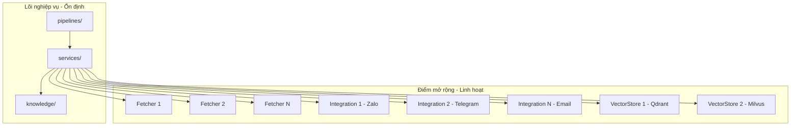

# Scalability Strategy

## Mục đích

Tài liệu này định nghĩa chiến lược và giới hạn về khả năng mở rộng (Scalability) của hệ thống AI-Radar. 

Khác với các hệ thống doanh nghiệp yêu cầu khả năng chịu tải cao (High Availability / Horizontal Scaling), AI-Radar được thiết kế với tư duy thực dụng: **Ưu tiên mở rộng chức năng (Functional Scalability) hơn là mở rộng hạ tầng (Infrastructure Scalability)**. 

Tài liệu này giúp xác định rõ những thành phần nào có thể dễ dàng mở rộng ngay trong kiến trúc hiện tại, và những thành phần nào bị giới hạn bởi thiết kế Monolithic của phiên bản đầu tiên (v1).

## Nguyên tắc mở rộng cốt lõi

Chiến lược mở rộng của AI-Radar tuân thủ tuyệt đối các nguyên tắc đã được khóa trong Software Design Document (SDD):

1. **Functional over Infrastructure:** Ưu tiên tối đa việc bổ sung nguồn dữ liệu, kênh tích hợp và khả năng xử lý tri thức mà không cần thay đổi hạ tầng triển khai.
2. **Extensibility by Design:** Kiến trúc sử dụng Interface và Adapter Pattern ở các ranh giới (Boundaries) để việc thêm mới một thành phần không làm ảnh hưởng đến lõi nghiệp vụ (Core Logic).
3. **No Premature Optimization:** Không triển khai các giải pháp phân tán (Distributed Systems), Message Queue hay Cluster nếu hệ thống chưa chạm đến ngưỡng giới hạn vật lý của một máy chủ đơn lẻ.
4. **Monolithic First:** Toàn bộ hệ thống trong v1 được đóng gói và triển khai dưới dạng một ứng dụng đơn thể (Monolith) chạy trên một Docker Container duy nhất.

## Khả năng mở rộng chức năng (Functional Scalability)

Kiến trúc hiện tại được thiết kế để hỗ trợ tối đa việc mở rộng về mặt nghiệp vụ và tích hợp. Các "điểm mở rộng" (Extension Points) được định nghĩa rõ ràng trong `FolderStructure.md`.

### 1. Mở rộng nguồn dữ liệu (Data Sources)
- **Cơ chế:** Thêm mới một Fetcher vào thư mục `app/fetchers/`.
- **Tác động kiến trúc:** Fetcher mới chỉ cần kế thừa `BaseFetcher`, triển khai logic lấy dữ liệu và trả về `RawArticle`. Các tầng phía sau (`knowledge/`, `vectorstores/`) hoàn toàn không cần thay đổi vì chúng chỉ làm việc với chuẩn `RawArticle` và `KnowledgeObject`.
- **Ví dụ:** Bổ sung thêm `arxiv_fetcher.py`, `reddit_fetcher.py`.

### 2. Mở rộng kênh phân phối (Notification Channels)
- **Cơ chế:** Thêm mới một Adapter vào thư mục `app/integrations/`.
- **Tác động kiến trúc:** Tầng `services/` (ví dụ: `DigestService`) chỉ sinh ra nội dung `Generated Text` chuẩn. Việc định dạng và gửi đi được đẩy hoàn toàn xuống tầng Integration. 
- **Ví dụ:** Bổ sung `integrations/telegram/` hoặc `integrations/email/` song song với `integrations/zalo/`.

### 3. Mở rộng năng lực xử lý AI (AI Capabilities)
- **Cơ chế:** Thay thế hoặc bổ sung Provider trong `app/integrations/groq/` hoặc `app/vectorstores/`.
- **Tác động kiến trúc:** Nhờ nguyên tắc *Replaceable Infrastructure*, Business Logic không gọi trực tiếp API của Groq hay Qdrant. Việc chuyển đổi sang một LLM khác (như OpenRouter, Ollama) hoặc một Vector DB khác (như Milvus) chỉ đòi hỏi thay đổi lớp Adapter và cấu hình trong `config/settings.py`.

### 4. Mở rộng quy trình xử lý tri thức (Knowledge Processing)
- **Cơ chế:** Thêm mới các Processor vào `app/knowledge/`.
- **Tác động kiến trúc:** `KnowledgeService` hoặc `KnowledgeUpdatePipeline` có thể được cấu hình để gọi thêm các bước xử lý mới (ví dụ: Entity Extraction, Sentiment Analysis) mà không phá vỡ luồng dữ liệu cốt lõi. Đầu ra cuối cùng vẫn được đóng gói vào `KnowledgeObject`.

## Giới hạn mở rộng hạ tầng (Infrastructure Limitations - v1)

Để tuân thủ nguyên tắc *Simplicity Wins* và *Avoid Over-Engineering*, AI-Radar v1 chấp nhận các giới hạn sau về mặt hạ tầng. Đây là những Trade-off có chủ đích, không phải là thiếu sót.

| Thành phần | Giới hạn trong v1 | Lý do kiến trúc (Trade-off) |
|---|---|---|
| **Application** | **Monolithic Deployment.** Chạy trên 1 Container duy nhất. | Không có nhu cầu chịu tải đồng thời (concurrent users) cao. Pipeline chạy nền (batch) và tương tác qua Zalo Webhook không yêu cầu Horizontal Scaling. |
| **Vector Database** | **Standalone Node.** Qdrant chạy 1 instance duy nhất. | Quy mô Knowledge Base cá nhân không vượt quá giới hạn RAM của một VPS tiêu chuẩn. Không sử dụng Qdrant Cluster. |
| **Task Processing** | **Synchronous / In-process.** Không dùng Message Broker. | Không sử dụng Celery, RabbitMQ hay Kafka. Pipeline chạy trực tiếp trong process của ứng dụng hoặc được kích hoạt qua CLI/GitHub Actions. |
| **Scheduler** | **External / Cron-based.** | Sử dụng GitHub Actions Cron hoặc Linux Crontab. Không tích hợp Distributed Scheduler (như Celery Beat) vào trong app. |
| **Storage** | **Local Volume.** Dữ liệu Qdrant lưu trên Docker Volume của 1 host. | Không sử dụng Distributed File System hay Cloud Object Storage cho Vector Data. |

## Chiến lược tiến hóa hạ tầng (Infrastructure Evolution Path)

Khi hệ thống phát triển và xuất hiện các "Pain Points" thực tế về hiệu năng hoặc dung lượng, kiến trúc cho phép các bước tiến hóa sau mà không cần viết lại Business Logic:

### Kịch bản 1: Qdrant trở thành nút thắt cổ chai (Bottleneck)
- **Dấu hiệu:** Thời gian Semantic Search tăng cao, RAM của Qdrant container vượt ngưỡng cho phép.
- **Giải pháp tiến hóa:** Chuyển từ Qdrant Standalone sang **Qdrant Cluster** (Replication & Sharding).
- **Tác động code:** Chỉ cần cập nhật `QDRANT_HOST` và cơ chế kết nối trong `app/vectorstores/qdrant.py`. Business Logic không thay đổi.

### Kịch bản 2: Pipeline cập nhật tri thức chạy quá lâu
- **Dấu hiệu:** Thời gian Fetch và Embedding vượt quá khung giờ cho phép của GitHub Actions / Cron.
- **Giải pháp tiến hóa:** Tách tầng xử lý nặng (Heavy Processing) ra khỏi Web Server bằng cách đưa vào **Message Queue (Redis/RabbitMQ) + Worker (Celery)**.
- **Tác động code:** `pipelines/` và `services/` sẽ không gọi trực tiếp các hàm xử lý nữa mà sẽ đẩy task (message) vào Queue. Worker sẽ nhận task và thực thi. Kiến trúc Layer vẫn được giữ nguyên.

### Kịch bản 3: Yêu cầu tính sẵn sàng cao (High Availability)
- **Dấu hiệu:** Hệ thống cần hoạt động 24/7 không gián đoạn để phục vụ Webhook Zalo.
- **Giải pháp tiến hóa:** Chuyển từ Single Docker Container sang **Docker Swarm** hoặc **Kubernetes**. Chạy nhiều bản sao (Replicas) của AI-Radar App đằng sau một Load Balancer.
- **Tác động code:** Do ứng dụng được thiết kế **Stateless** (không lưu session user hay trạng thái pipeline dang dở trong RAM), việc nhân bản ứng dụng (Horizontal Scaling) có thể thực hiện ngay lập tức mà không cần sửa code.

## Sơ đồ điểm mở rộng (Extension Points Map)

Sơ đồ dưới đây minh họa các ranh giới mà hệ thống có thể dễ dàng mở rộng mà không vi phạm kiến trúc cốt lõi.

## Kết luận

Chiến lược Scalability của AI-Radar là một minh chứng rõ nét cho triết lý *Goal First* và *Trade-off Over Perfection*. Bằng việc tập trung toàn lực vào khả năng mở rộng chức năng (Functional Scalability) thông qua kiến trúc Module hóa chặt chẽ, hệ thống có thể thích ứng với vô số nguồn dữ liệu và kênh phân phối mới. 

Đồng thời, việc mạnh dạn giới hạn khả năng mở rộng hạ tầng (Infrastructure Scalability) trong v1 giúp dự án giữ được sự đơn giản tối đa, giảm thiểu chi phí vận hành và thời gian bảo trì, chỉ sẵn sàng tiến hóa lên các kiến trúc phân tán khi có nhu cầu thực tế và dữ liệu chứng minh rõ ràng.