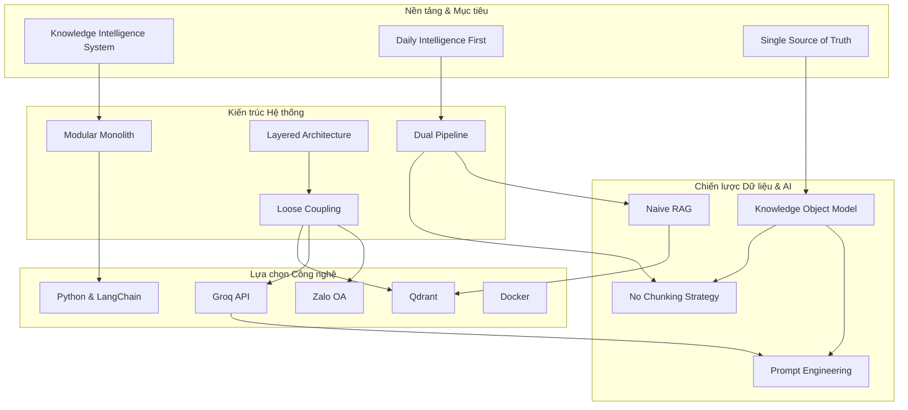

# Decision Dependency Graph

## Mục đích
Tài liệu này mô tả mối quan hệ phụ thuộc (Dependency) giữa các quyết định thiết kế trong AI-Radar. Không có quyết định nào tồn tại độc lập hoàn toàn; mỗi lựa chọn công nghệ hoặc kiến trúc đều là hệ quả của các quyết định nền tảng trước đó.

Việc hiểu rõ sơ đồ phụ thuộc giúp đảm bảo rằng khi cần thay đổi một quyết định ở tầng dưới (ví dụ: thay đổi Vector Database), chúng ta sẽ biết chính xác những quyết định nào ở tầng trên sẽ bị ảnh hưởng.

## Sơ đồ phụ thuộc tổng thể
Sơ đồ dưới đây minh họa luồng ảnh hưởng từ Mục tiêu dự án $\rightarrow$ Kiến trúc $\rightarrow$ Công nghệ cụ thể.

## Giải thích các mối phụ thuộc chính

### 1. Từ Mục tiêu đến Kiến trúc
-   **Knowledge Intelligence System $\rightarrow$ Modular Monolith:** Vì mục tiêu là xây dựng một hệ thống tri thức cá nhân hiệu quả chứ không phải nền tảng đa người dùng chịu tải cao, nên kiến trúc Monolith được chọn để tối ưu sự đơn giản và tốc độ phát triển.
-   **Daily Intelligence First $\rightarrow$ Dual Pipeline:** Tính năng bản tin hàng ngày yêu cầu hệ thống phải chủ động cập nhật dữ liệu theo lịch (Scheduled), dẫn đến quyết định tách biệt hoàn toàn với luồng truy vấn tương tác (Interactive) của người dùng.

### 2. Từ Kiến trúc đến Công nghệ
-   **Loose Coupling $\rightarrow$ Qdrant/Groq/Zalo:** Nguyên tắc liên kết lỏng lẻo cho phép chúng ta chọn các công nghệ tốt nhất hiện tại (Qdrant cho vector, Groq cho tốc độ LLM, Zalo cho kênh phân phối) mà vẫn giữ khả năng thay thế chúng trong tương lai thông qua các Adapter.
-   **Layered Architecture $\rightarrow$ Python & LangChain:** Cấu trúc phân tầng phù hợp với việc sử dụng Python và LangChain để trừu tượng hóa các lớp hạ tầng (LLM, Vector Store) khỏi logic nghiệp vụ.

### 3. Từ Chiến lược Dữ liệu đến Triển khai AI
-   **Knowledge Object Model $\rightarrow$ No Chunking:** Vì chúng ta lưu trữ tri thức đã được chuẩn hóa (tóm tắt, ý chính) thay vì bài báo gốc, nên mỗi Knowledge Object đủ ngắn gọn để trở thành một vector duy nhất. Điều này loại bỏ nhu cầu chunking phức tạp.
-   **Naive RAG $\rightarrow$ Prompt Engineering:** Khi không sử dụng các kỹ thuật RAG phức tạp như GraphRAG hay Agentic RAG, chất lượng câu trả lời phụ thuộc rất lớn vào việc thiết kế Prompt cẩn thận để hướng dẫn LLM sử dụng đúng Context từ Knowledge Object.

## Kết luận
Sơ đồ phụ thuộc này khẳng định tính nhất quán của toàn bộ hệ thống. Mọi thay đổi trong tương lai cần được đánh giá dựa trên luồng ảnh này để tránh phá vỡ các nguyên tắc nền tảng đã được thiết lập.